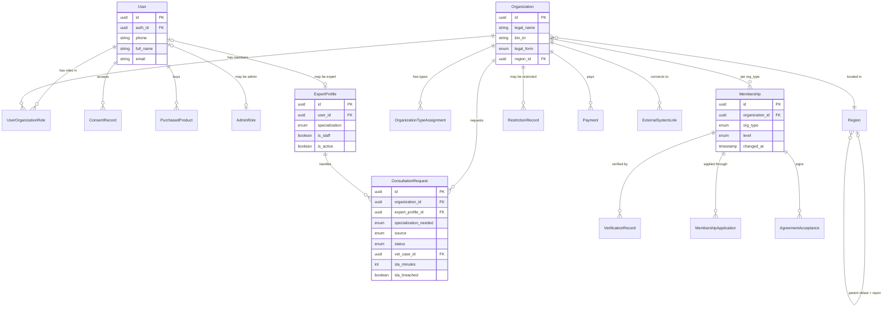
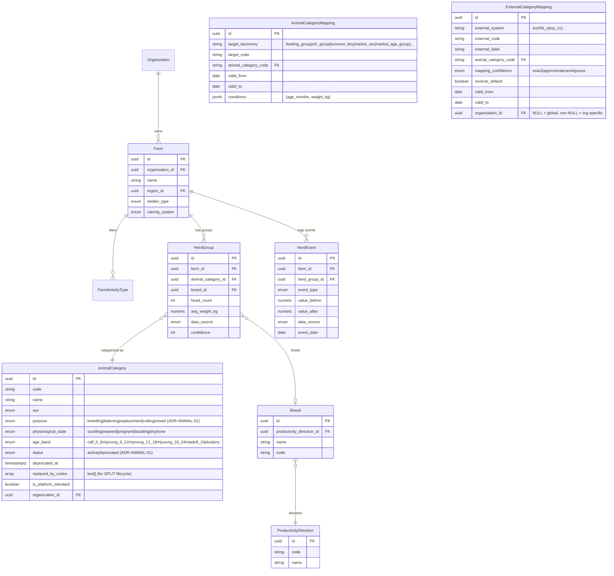
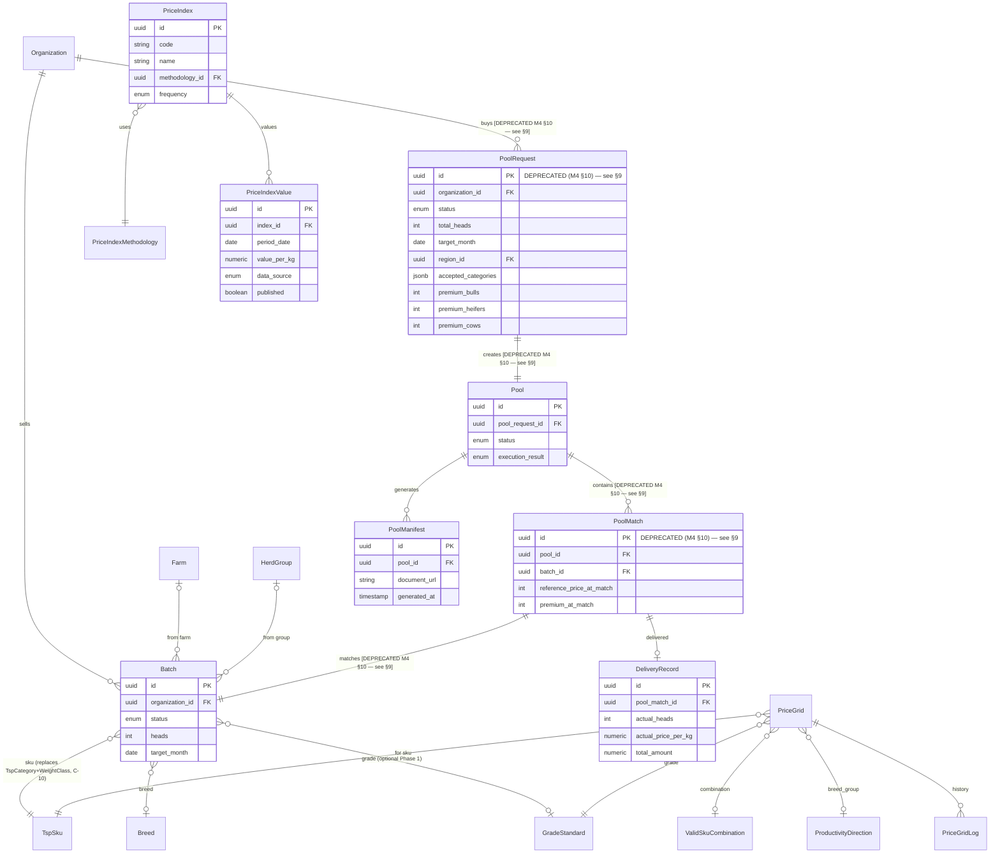
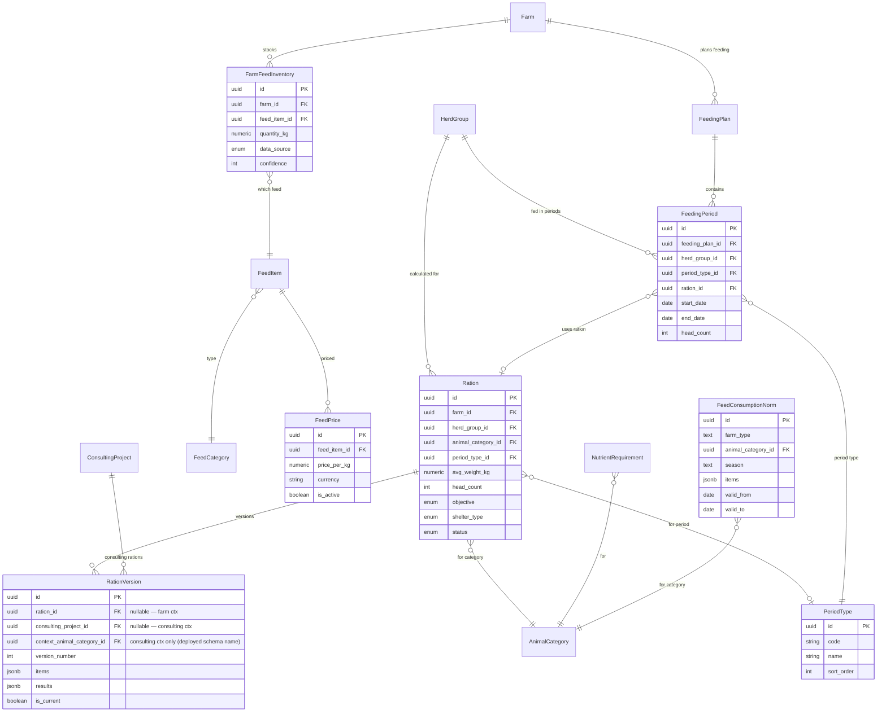
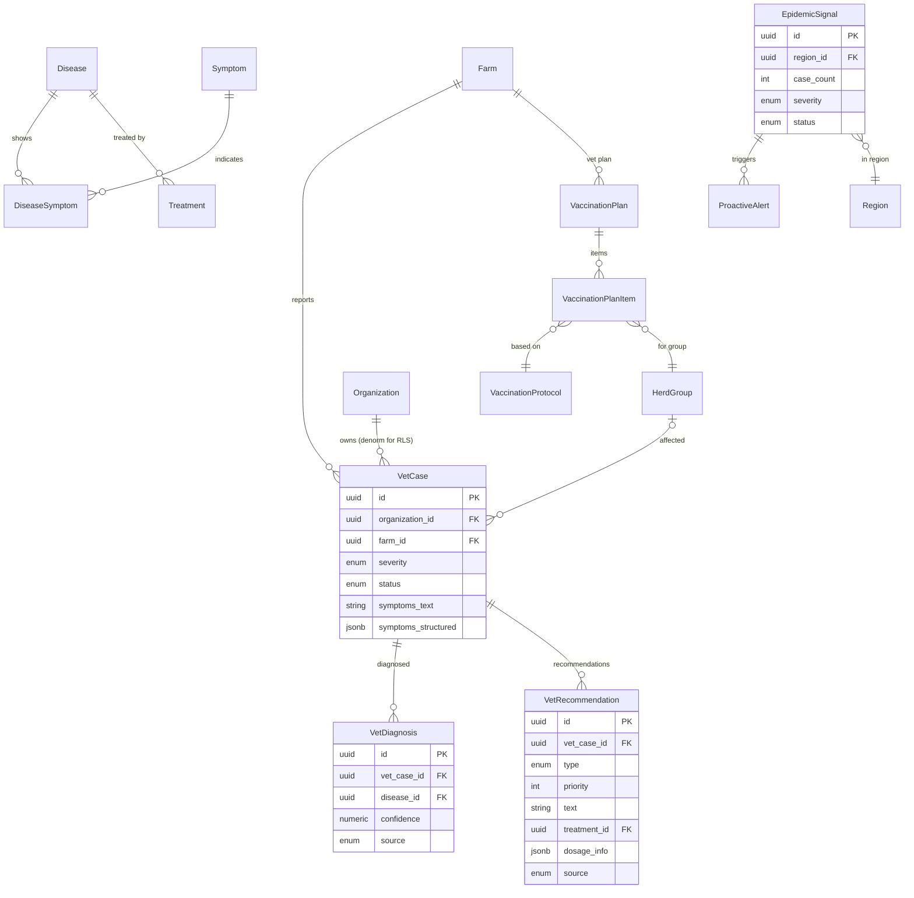
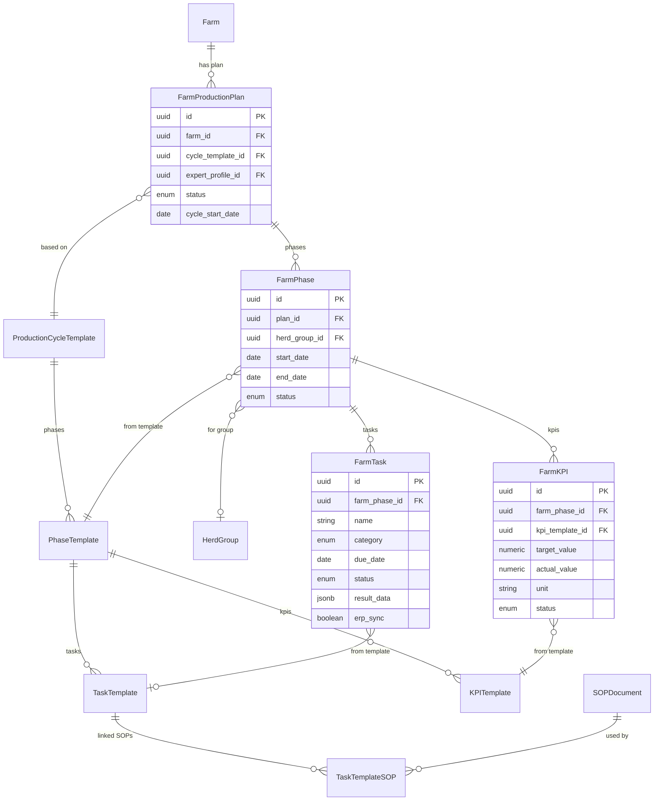
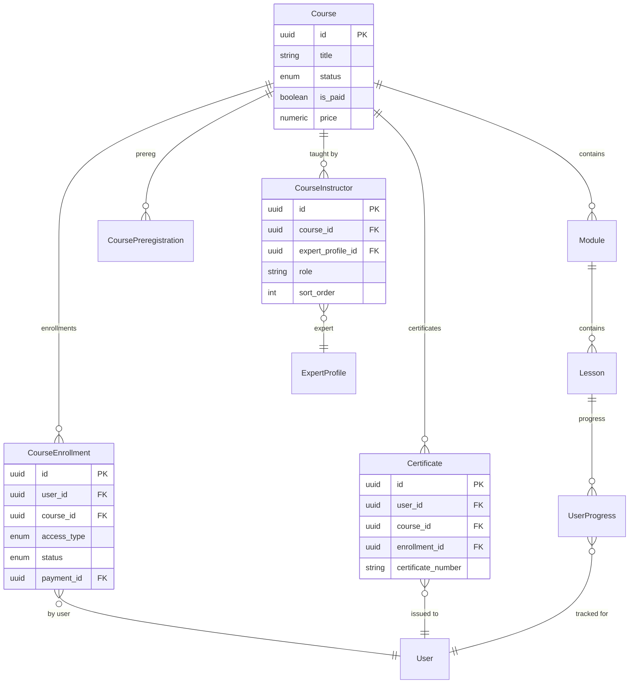
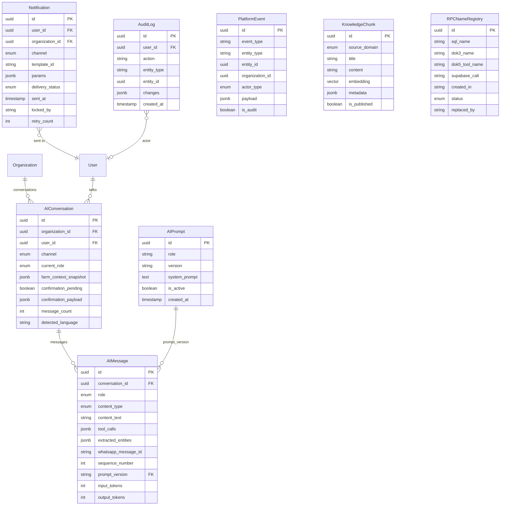
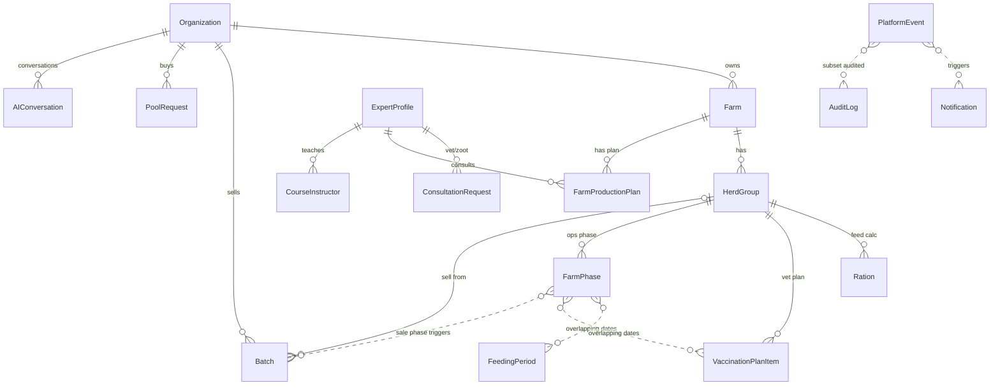

# AGOS Domain Model Specification (Док 1)

**Project:** TURAN Agricultural Operating System
**Version:** 1.9
<!-- Version: 1.9 — updated 22 June 2026 -->
**Date:** 5 March 2026 (schema consolidation); updated 22 June 2026 (M4+M6 TSP Extension)
**Status:** Complete — ready for SQL (Док 2)
**Authors:** Arshidin (CEO/Domain Expert), Claude (CTO/Architect)

---

## 0. How to Read This Document

This is the **single source of truth** for AGOS data model. Every entity, relationship, and ownership rule is defined here. All other documents (SQL, RPCs, AI Gateway, Interface Contracts) derive from this.

**For vibecoding team (Lovable/Cursor/Claude Code):**
- Entity names are **PascalCase English** (e.g., HerdGroup, FarmTask)
- Field names are **snake_case** (e.g., organization_id, head_count)
- ERDs are **Mermaid** — paste into any renderer
- Ownership Matrix tells you who reads/writes each entity — critical for RLS policies

**Notation:**
- FK = Foreign Key
- PK = Primary Key
- FSM = Finite State Machine (status transitions)
- JSONB = PostgreSQL JSON binary type
- ✅ = confirmed, ⚠️ = needs detail in Dok 2, 🔮 = future

---

## 1. Architecture Overview

```
Layer 3: INTELLIGENCE
  AI Gateway (Python FastAPI + LangGraph)
  ├── 4 roles: zootechnician, vet, consultant, trading_agent
  ├── Entity extraction (dialogue → Farm Graph via validated RPC)
  ├── Epidemiological intelligence (case → signal → alert)
  ├── Proactive engine (reminders, warnings, recommendations)
  ├── Compliance filter
  └── KnowledgeChunk (pgvector RAG across all domains)

Layer 2: INTERFACES
  Web Cabinet (Lovable) | WhatsApp (AI) | Expert Console
  All call same RPCs. Action in one visible in others.

Layer 1: MODULES
  Market/TSP (15) | Feed & Nutrition (10) | Veterinary (12) | Operations (10) | Education (8)
  Each reads from / writes to Farm Graph.
  Each publishes events to Event Bus.

Layer 0: KERNEL
  Identity (17) | Farm (7) | Platform (8)
  Supabase PostgreSQL. Single source of truth.
  RPC functions (SECURITY DEFINER). RLS policies.
```

**One database. One auth. One identity. Farm Graph as source of truth.**
**Business logic in RPC. AI and Web call the same functions. Zero duplication.**

---

## 2. Domain Map

```
┌─────────────────────────────────────────────────────────────────────────┐
│                        KERNEL (Layer 0)                                 │
│                                                                         │
│  ┌─── Identity (17) ───┐  ┌──── Farm (7) ────┐  ┌── Platform (8) ──┐  │
│  │ User                 │  │ Farm              │  │ AIConversation   │  │
│  │ Organization         │  │ FarmActivityType  │  │ AIMessage        │  │
│  │ OrganizationTypeAssn │  │ HerdGroup         │  │ PlatformEvent    │  │
│  │ UserOrganizationRole │  │ HerdEvent         │  │ Notification     │  │
│  │ Membership           │  │ AnimalCategory*   │  │ AuditLog         │  │
│  │ VerificationRecord   │  │ Breed*            │  │ KnowledgeChunk   │  │
│  │ MembershipApplication│  │ ProductivityDir*  │  └──────────────────┘  │
│  │ ConsentRecord        │  └──────────────────┘  │ AIPrompt         │  │
│  │ AgreementAcceptance  │         ▲               │ RPCNameRegistry  │  │
│  │ RestrictionRecord    │         │ all modules   │ KnowledgeChunk   │  │
│  │ AdminRole            │         │ read          └──────────────────┘  │
│  │ Region*              │─────────┘                                     │
│  │ ExternalSystemLink   │                                               │
│  │ Payment              │                                               │
│  │ PurchasedProduct     │                                               │
│  │ ExpertProfile        │──────────────────────┐ experts serve          │
│  │ ConsultationRequest  │                      │ all modules            │
│  └──────────────────────┘                      │                        │
│                                                │                        │
│  * = reference/lookup table                    │                        │
└────────────────────────────────────────────────┼────────────────────────┘
                                                 │
┌────────────────────────────────────────────────┼────────────────────────┐
│                       MODULES (Layer 1)        │                        │
│                                                │                        │
│  ┌── Market/TSP (15) ──┐  ┌─ Feed (10) ──┐   │  ┌── Vet (18) ──────┐ │
│  │ Batch                │  │ FeedCategory* │   │  │ Disease*          │ │
│  │ PoolRequest          │  │ FeedItem*     │   │  │ Symptom*          │ │
│  │ Pool                 │  │ FeedPrice     │   │  │ DiseaseSymptom    │ │
│  │ PoolMatch            │  │ NutrientReq*  │   │  │ Treatment*        │ │
│  │ DeliveryRecord       │  │ PeriodType*   │   │  │ VetCase           │ │
│  │ PoolManifest         │  │ FarmFeedInv   │   │  │ VetDiagnosis      │ │
│  │ PriceGrid            │  │ Ration        │   │  │ VetRecommendation │ │
│  │ PriceGridLog         │  │ RationVersion │   │  │ VaccinationProto* │ │
│  │ TspSku*              │  │ FeedingPlan   │   │  │ VaccinationPlan   │ │
│  │ WeightClass*         │  │ FeedingPeriod │   │  │ VaccPlanItem      │ │
│  │ GradeStandard*       │  └───────────────┘   │  │ EpidemicSignal    │ │
│  │ ValidSkuCombination  │                      │  │ ProactiveAlert    │ │
│  │ VetProduct*       │ │
│  │ EpidemicThreshold*│ │
│  │ SymptomEvidence   │ │
│  │ TreatmentLog      │ │
│  │ HealthRestriction │ │
│  │ VaccinationRecord │ │
│  │  (← v1.4 +6)     │ │
│  └───────────────────┘ │
│  │ PriceIndex           │                      │                        │
│  │ PriceIndexValue      │                      │                        │
│  │ PriceIndexMethodology│                      │                        │
│  └──────────────────────┘                      │                        │
│                                                │                        │
│  ┌── Operations (10) ──────────────────────────┘───────────────────┐    │
│  │ ProductionCycleTemplate*  FarmProductionPlan                    │    │
│  │ PhaseTemplate*            FarmPhase                             │    │
│  │ TaskTemplate*             FarmTask                              │    │
│  │ SOPDocument*              FarmKPI                               │    │
│  │ TaskTemplateSOP                                                 │    │
│  │ KPITemplate*                                                    │    │
│  └─────────────────────────────────────────────────────────────────┘    │
│                                                                         │
│  ┌── Education (8) ────┐                                                │
│  │ Course               │                                               │
│  │ Module               │                                               │
│  │ Lesson               │                                               │
│  │ CourseEnrollment     │                                               │
│  │ UserProgress         │                                               │
│  │ Certificate          │                                               │
│  │ CoursePreregistration│                                               │
│  │ CourseInstructor     │                                               │
│  └──────────────────────┘                                               │
└─────────────────────────────────────────────────────────────────────────┘
```

**Entity count by domain:**

| Domain | Layer | Entities | Reference | Operational | Log/Append |
|--------|-------|----------|-----------|-------------|------------|
| Identity | Kernel | 17 | 1 (Region) | 14 | 2 (Consent, Agreement) |
| Farm | Kernel | 7 | 3 (AnimalCat, Breed, ProdDir) | 3 | 1 (HerdEvent) |
| Platform | Kernel | 8 | 1 (RPCNameRegistry) | 5 | 2 (PlatformEvent, AuditLog) |
| Market/TSP | Module | 15 | 4 (TspSku, WeightClass, Grade, ValidSkuComb) | 9 | 2 (PriceGridLog, PriceIndexValue) |
| Feed | Module | 10 | 5 (FeedCat, FeedItem, FeedPrice, NutrientReq, PeriodType) | 5 | 0 |
| Veterinary | Module | 18 | 5 (Disease, Symptom, DisSymp, Treatment, VaccProto) | 13 | 0 |
| Operations | Module | 10 | 6 (CycleTemp, PhaseTemp, TaskTemp, SOP, TaskSOP, KPITemp) | 4 | 0 |
| Education | Module | 8 | 0 | 8 | 0 |
| **Total** | | **93** | **25** | **61** | **7** |

**Note:** FeedBudget and NutrientBalance are computed RPCs, not entities (see Section 5.6). CourseInstructor is a junction table (Course ↔ ExpertProfile).

---

## 3. Consolidated ERD

### 3.1. Kernel: Identity

> Identity is canon'd by Microstep 1 (Identity v0.2). This section is DERIVED; where it conflicts, Microstep 1 wins. Code gaps tracked in IMPL_DEBT (IDENTITY-01..11).



### 3.2. Kernel: Farm



### 3.3. Module: Market/TSP

> **DEPRECATED entities in this ERD:** `PoolRequest` and `PoolMatch` are **DEPRECATED (M4 §10)**. Legacy rows preserved for historical compatibility (P7). Authoritative M4/M6 model (Pool/pool_lines/Offer/LivestockCategoryRule/MinimumPrice) is in **§9 (v1.9 patch notes)**.



### 3.4. Module: Feed & Nutrition



### 3.5. Module: Veterinary



### 3.6. Module: Operations



### 3.7. Module: Education



### 3.8. Kernel: Platform



### 3.9. Cross-Domain Relationships



---

## 4. Ownership Matrix

### Legend
- **C** = Creates (source of initial data)
- **U** = Updates (can modify)
- **R** = Reads (consumes data)
- **A** = Authority (wins when sources disagree)
- **—** = No access

### 4.1. Identity Domain

| Entity | Farmer | Admin | Expert | System | AI Gateway |
|--------|--------|-------|--------|--------|------------|
| User | C/U/A | U | — | C (auth) | R |
| Organization | C/U | U/A (validate) | — | — | R |
| OrganizationTypeAssignment | C | U | — | — | R |
| UserOrganizationRole | C (owner) | U/A | — | — | R |
| Membership | — | U/A (transitions) | — | C (initial) | R |
| VerificationRecord | — | C/A | — | — | R |
| MembershipApplication | C | U/A (review) | — | — | R |
| ConsentRecord | — | — | — | C/A | R |
| AgreementAcceptance | C (signs) | — | — | — | R |
| RestrictionRecord | — | C/U/A | — | — | R |
| AdminRole | — | C/U/A | — | — | — |
| Region | — | C/U/A | — | — | R |
| ExternalSystemLink | C | U | — | — | R |
| Payment | — | — | — | C/A | R |
| PurchasedProduct | — | — | — | C/A | R |
| ExpertProfile | — | C/U/A | U (own bio) | — | R |
| ConsultationRequest | C (direct) | U (assign) | U/A (resolve) | C (auto-escalation) | C (ai_referral) |

### 4.2. Farm Domain

| Entity | Farmer | Admin | Expert | System | AI Gateway | ERP |
|--------|--------|-------|--------|--------|------------|-----|
| Farm | C/U/A | R | R | — | R | — |
| FarmActivityType | C/U | R | R | — | R | — |
| HerdGroup | C/U (L3) | R | R | C (L1 registration) | C/U (L2 extract) | U/A (L4) |
| HerdEvent | — | R | R | C/A (auto-log) | R | C (sync) |
| AnimalCategory | — | C/U/A | — | — | R | R |
| Breed | — | C/U/A | U | — | R | R |
| ProductivityDirection | — | C/U/A | — | — | R | R |

### 4.3. Market/TSP Domain

> **Note:** `PoolRequest` and `PoolMatch` rows below are **DEPRECATED (M4 §10)**. Authoritative ownership for M4/M6 entities (Pool/pool_lines/Offer/LivestockCategoryRule/MinimumPrice) is in **§9**.

| Entity | Farmer | MPK | Admin | System | AI Gateway |
|--------|--------|-----|-------|--------|------------|
| Batch | C/U/A | — | U (match/cancel) | U (expire) | C (draft) |
| PoolRequest *(DEPRECATED M4 §10 — see §9)* | — | C/U/A | U (close) | U (expire) | R |
| Pool | — | — | U/A | C (auto on PR activate) | R |
| PoolMatch *(DEPRECATED M4 §10 — see §9)* | — | — | C/A | — | R |
| DeliveryRecord | — | C/U (actuals) | U/A (confirm) | C (skeleton) | R |
| PoolManifest | — | R | C | C/A (generate) | R |
| PriceGrid | — | — | C/U/A | — | R |
| PriceGridLog | — | — | — | C/A (auto) | R |
| TspCategory | — | — | C/U/A | — | R |
| WeightClass | — | — | C/U/A | — | R |
| GradeStandard | — | — | C/U/A | — | R |
| ValidCombination | — | — | C/U/A | — | R |
| PriceIndex | — | — | C/U | — | R |
| PriceIndexValue | — | — | C/U/A (expert) | — | R |
| PriceIndexMethodology | — | — | C/U/A | — | R |

### 4.4. Feed & Nutrition Domain

| Entity | Farmer | Admin | Expert | System | AI Gateway | ERP |
|--------|--------|-------|--------|--------|------------|-----|
| FeedCategory | — | C/U/A | U | — | R | — |
| FeedItem | — | C/U/A | U | — | R | — |
| FeedPrice | — | C/U/A | U | — | R | — |
| FeedConsumptionNorm | — | C/U/A | U | — | R | — |
| NutrientRequirement | — | C/U/A | U | — | R | — |
| PeriodType | — | C/U/A | — | — | R | — |
| FarmFeedInventory | C/U (L3) | R | R | — | C/U (L2) | U/A (L4) |
| Ration | C/U | R | R | C/A (calculate) | C (quick mode) | — |
| RationVersion | — | — | — | C/A (calculate, farm OR consulting) | — | — |
| FeedingPlan | C/U | R | U | C (generate) | R | — |
| FeedingPeriod | C/U | R | U | C (generate) | R | — |

### 4.5. Veterinary Domain

| Entity | Farmer | Admin | Expert (vet) | System | AI Gateway |
|--------|--------|-------|--------------|--------|------------|
| Disease | — | U | C/U/A | — | R |
| Symptom | — | U | C/U/A | — | R |
| DiseaseSymptom | — | — | C/U/A | — | R |
| Treatment | — | — | C/U/A | — | R (dosages!) |
| VetCase | R | R | U/A (diagnose) | — | C (from dialogue) |
| VetDiagnosis | R | R | C/U/A (override) | — | C (ai_analysis) |
| VetRecommendation | R | R | C/U/A | — | C (ai_generated) |
| VaccinationProtocol | — | U | C/U/A | — | R |
| VaccinationPlan | R | R | U/A (review) | C (generate) | R |
| VaccinationPlanItem | C/U (confirm) | R | U | C (generate) | R (remind) |
| EpidemicSignal | — | R | U/A (confirm) | C (detect) | C (analyze) |
| ProactiveAlert | — | R | C/U/A (approve) | C (draft) | R |

### 4.6. Operations Domain

| Entity | Farmer | Admin | Expert (zoot) | System | AI Gateway |
|--------|--------|-------|---------------|--------|------------|
| ProductionCycleTemplate | — | R | C/U/A | — | R |
| PhaseTemplate | — | R | C/U/A | — | R |
| TaskTemplate | — | R | C/U/A | — | R |
| SOPDocument | — | U | C/U/A | — | R |
| TaskTemplateSOP | — | — | C/U/A | — | R |
| KPITemplate | — | R | C/U/A | — | R |
| FarmProductionPlan | R | R | C/U/A (adapt) | C (generate from template) | R |
| FarmPhase | R/U (dates) | R | U/A | C (generate) | R |
| FarmTask | R/U (complete) | R | U | C (generate) | C/U (WhatsApp completion) |
| FarmKPI | R | R | U/A (set targets) | C/U (compute actuals) | R |

### 4.7. Education Domain

| Entity | Farmer/User | Admin | Expert | System | AI Gateway |
|--------|-------------|-------|--------|--------|------------|
| Course | R | C/U/A | — | — | R |
| Module | R | C/U/A | — | — | R |
| Lesson | R | C/U/A | — | — | R |
| CourseEnrollment | C (enroll) | U | — | C/A (on payment) | R |
| UserProgress | — | R | — | C/U/A (track) | R |
| Certificate | R | R | — | C/A (auto-issue) | R |
| CoursePreregistration | C | R | — | — | R |
| CourseInstructor | — | C/U/A | — | — | R |

### 4.8. Platform Domain

| Entity | Farmer | Admin | Expert | System | AI Gateway |
|--------|--------|-------|--------|--------|------------|
| AIConversation | — | R | R | — | C/U/A |
| AIMessage | — | R | R | — | C/A |
| PlatformEvent | — | R | R | C/A | R |
| Notification | R | R | R | C/A | C (proactive) |
| AuditLog | — | R | — | C/A | — |
| KnowledgeChunk | — | U | C/U/A (review) | — | R (RAG search) |
| AIPrompt | — | C/U/A | — | — | R (get_active_prompt) |
| RPCNameRegistry | — | C/U/A | — | C (seed) | R |

---

## 5. Cross-Domain Integration Patterns

### 5.1. Three Parallel Plans (Operations ↔ Feed ↔ Vet)

```
Production Plan:  [--Calving--][--Suckling--------][Weaning][--Breeding--]
Feeding Plan:     [------Stall------][--Trans--][---Pasture---][--Stall--]
Vaccination Plan:    [Vacc]                [Treatment]      [Vacc]

Connection: shared HerdGroup + overlapping dates
NOT FK ownership — coordination by date overlap
```

AI unifies all three: "This week: breeding starts (Operations). Switch to breeding ration (Feed). Spring vaccination due (Vet)."

### 5.2. Operations → TSP Prediction

```
FarmPhase (finishing, steers, Jan-May)
  → KPI: target weight 400kg
  → System tracks HerdGroup.avg_weight_kg
  → When approaching target:
     AI: "Your steers are ~380kg. Create a batch?"
  → TSP aggregates: "15 farms plan to sell 400+ kg steers in May"
```

### 5.3. Data Flywheel

```
AI Dialogue → entity extraction (logged in AIMessage)
  → validated RPC → HerdGroup updated (Level 2)
  → FeedingPlan adjusts
  → Operations plan becomes more accurate
  → TSP supply prediction improves
  → PriceIndex data enriches

Each interaction makes the system smarter.
```

### 5.4. Layered Truth

```
Level 4 (highest): ERP — individual animal records aggregated
Level 3:           Platform — farmer manually entered/confirmed
Level 2:           AI-extracted — from conversation (draft, needs confirmation)
Level 1 (lowest):  Registration — initial rough numbers

Applies to: HerdGroup, FarmFeedInventory
Higher confidence replaces lower. System useful at any level.
```

### 5.5. Event Bus (27 event types)

| # | Event Type | Domain | Producer | Key Consumer |
|---|------------|--------|----------|--------------|
| 1 | identity.membership.activated | identity | Admin | AI (context), Notification |
| 2 | identity.membership.suspended | identity | Admin | Notification, access control |
| 3 | farm.herd_group.updated | farm | Farmer/AI/ERP | Feed (ration recalc), Ops (phase adjust) |
| 4 | farm.herd_event.created | farm | System (auto-log) | Analytics, AI context |
| 5 | feed.ration.calculated | feed | System (RPC) | AI context, Notification |
| 6 | feed.inventory.updated | feed | Farmer/AI/ERP | Feed budget recalc |
| 7 | market.batch.published | market | Farmer/AI | Pool matching engine |
| 8 | market.batch.matched | market | Admin | Notification (farmer) |
| 9 | market.pool.executing | market | Admin | Notification (contacts reveal) |
| 10 | market.pool.delivered | market | MPK | DeliveryRecord, Notification |
| 11 | market.delivery.confirmed | market | Admin | Reputation calc, Analytics |
| 12 | vet.case.created | vet | AI Gateway | Epidemic signal aggregation |
| 13 | vet.case.escalated | vet | System/AI | ConsultationRequest, Notification (expert) |
| 14 | vet.signal.detected | vet | System | Expert review queue, Notification (admin) |
| 15 | vet.signal.confirmed | vet | Expert | ProactiveAlert (draft), Notification (admin) |
| 16 | vet.vaccination.reminded | vet | System (cron) | Notification (farmer via AI WhatsApp) |
| 17 | vet.vaccination.overdue | vet | System (cron) | Notification (farmer + expert) |
| 18 | education.enrollment.completed | education | System | Certificate issue, Notification |
| 19 | ops.plan.activated | ops | Expert | Notification (farmer), AI context |
| 20 | ops.phase.started | ops | System (cron) | AI context (weekly briefing) |
| 21 | ops.phase.completed | ops | System | Next phase trigger, Analytics |
| 22 | ops.task.due_soon | ops | System (cron) | Notification (farmer via AI WhatsApp) |
| 23 | ops.task.overdue | ops | System (cron) | Notification (farmer + expert) |
| 24 | ops.task.completed | ops | Farmer/AI/ERP | HerdEvent (cross-domain RPC), KPI update |
| 25 | ops.kpi.missed | ops | System | Notification (expert), plan review |
| 26 | platform.consultation.requested | platform | Farmer/AI/System | Expert queue, Notification (expert) |
| 27 | platform.consultation.completed | platform | Expert | Notification (farmer), AuditLog |

---

## 5.6. Computed Data (RPCs, not entities)

These are NOT stored entities — they are computed on demand. Per D87, placement depends on complexity:

| RPC | Domain | Placement | Input | Output |
|-----|--------|-----------|-------|--------|
| get_aggregated_supply | Market | **PostgreSQL** (data access + RLS) | region_id, target_month | Anonymous supply totals |
| get_aggregated_demand | Market | **PostgreSQL** (data access + RLS) | region_id, target_month | Anonymous demand totals |
| calculate_reputation | Market | **PostgreSQL** (simple aggregate) | organization_id | Delivery count, success rate |
| calculate_ration | Feed | **Edge Function / FastAPI** (NASEM LP solver) | animal_category, weight, feeds[] | RationVersion with nutrients |
| get_feed_budget | Feed | **Edge Function / FastAPI** (matrix calc) | farm_id, feeding_plan_id | Annual need, deficit per feed |
| get_nutrient_balance | Feed | **Edge Function / FastAPI** (matrix calc) | ration_version_id | Balance vs requirements |

**FSM transitions** (publish_batch, match_pool, escalate_vet_case, etc.) — always **PostgreSQL RPC** for atomicity.

---

## 5.7. FSM Catalog

Every entity with a `status` field follows explicit state transitions. **Unlisted transitions are forbidden.**

### Identity

> Identity is canon'd by Microstep 1 (Identity v0.2). This section is DERIVED; where it conflicts, Microstep 1 wins. Code gaps tracked in IMPL_DEBT (IDENTITY-01..11).

**Membership (farmer):**
```
registered → observer → declared_supplier → standard_supplier
```
- registered → observer: entrance fee paid + MembershipApplication approved
- observer → declared_supplier: VerificationRecord (approved) + AgreementAcceptance (TSP)
- declared_supplier → standard_supplier: data-driven (DeliveryRecord history), admin decision

**Membership (MPK):**
```
registered → observer → active_buyer
```
- registered → observer: entrance fee paid
- observer → active_buyer: fee + VerificationRecord (approved)

**MembershipApplication:**
```
submitted → under_review → approved | rejected
```

**ConsultationRequest:**
```
pending → assigned → in_progress → completed
```
- pending: created (by farmer, AI, or auto-escalation)
- assigned: expert_profile_id set (admin or auto by specialization+region)
- in_progress: expert accepted
- completed: resolution provided

### Market/TSP

**Batch:**
```
draft → published → matched | cancelled | expired
matched → published (admin rollback with reason)
draft → [deleted]
```

**Batch editability:**
- draft: all fields editable
- published: only heads, notes, target_month (product cell locked)
- matched / cancelled / expired: all fields locked

**PoolRequest:**
```
draft → active → closed | expired
```
- draft → active: auto-creates Pool
- active → closed: pool filled, or admin/MPK closes
- active → expired: system (target_month passed)

**Pool:**
```
filling → filled → executing → dispatched → delivered → executed
filling → closed (admin: underfilled)
executing → executed (skip dispatched/delivered if simple)
```
- filling → filled: matched_heads ≥ total_heads, admin confirms
- filled → executing: admin triggers, contacts revealed, PoolManifest available
- dispatched/delivered: optional intermediate tracking
- executed: final, execution_result = full | partial | failed

**DeliveryRecord:**
```
pending → delivered | rejected | partial
```

### Feed & Nutrition

**Ration:**
```
draft → active → archived
```

**FeedingPlan:**
```
draft → active → completed
```

### Veterinary

**VetCase:**
```
open → in_progress → resolved | escalated
```
- open: created from AI dialogue or expert manual
- in_progress: diagnosis added
- resolved: recommendations completed
- escalated: auto (severity=critical) or manual → creates ConsultationRequest

**VaccinationPlan:**
```
pending_review → active → completed | expired
```
- pending_review: system-generated from protocols + herd structure (replaces legacy `draft` — D97 override; see d04_vet.sql:766-775)
- active: reviewed by expert (reviewed_by, reviewed_at set)
- completed: all items completed/skipped
- expired: plan period elapsed without completion

**VaccinationPlanItem:**
```
scheduled → reminded → completed | skipped
scheduled → overdue
overdue → completed (late)
```
Reminder flow: 14 days before → 3 days before → day of → 7 days after = overdue

**EpidemicSignal:**
```
detected → confirmed | false_positive → resolved
```
- detected: system (threshold crossed)
- confirmed: vet expert verified
- resolved: situation returned to normal

**ProactiveAlert:**
```
draft → approved → sent
```
- epidemic_warning: MUST be approved by vet expert
- seasonal_prevention, vaccination_reminder: auto-approved

| D94 | vet_products = reference catalogue with lifecycle | draft→validated→active→deprecated. Expert validates before use in treatment RPC. Closes D61 risk: dosage safety via FK + withdrawal enforcement |
| D95 | epidemic_thresholds = P8 data, not code | Threshold per disease (specific overrides default). 4 severity levels. Expert-managed. No code deployment for threshold changes |
| D96 | symptom_evidence = append-only evidence base | Traceability: ai_message_id links evidence to original conversation. "Digital autopsy" pattern: reconstruct any case fully from evidence chain |
| D97 | treatment_logs = immutable manipulation journal | Q71 (medical inventory auto-deduction) explicitly deferred. FK to vet_products ensures only registered drugs logged |
| D98 | health_restrictions = TSP Safety Gate | GENERATED COLUMN is_active eliminates cron jobs. create_batch RPC: single SELECT check. Sources: medication withdrawal (D63), quarantine, disease suspicion |
| D99 | vaccination_records with batch number | vaccine_batch_number required for export certification. On INSERT trigger: auto-complete plan_item + create health_restriction if withdrawal > 0 |
### Operations

**FarmProductionPlan:**
```
draft → active → completed
draft | active → cancelled
```
- cancelled: plan abandoned by expert or system (replaces; existing FarmPhase records preserved)

**FarmPhase:**
```
upcoming → active → completed | skipped
```
- upcoming: generated, not yet started
- active: start_date reached (cron)
- completed: all tasks done or end_date reached
- skipped: expert decision (e.g., no animals in this group)

**FarmTask:**
```
scheduled → reminded → in_progress → completed | skipped
scheduled | reminded → overdue
overdue → completed (late)
```
- reminded: system (N days before due_date, via AI WhatsApp)
- in_progress: farmer/expert started
- completed: confirmed via WhatsApp (primary), web, or ERP
- skipped: farmer skips with reason

**FarmKPI:**
```
pending → achieved | missed
```
- pending: target set from template
- achieved/missed: system computes (actual_value vs target_value)

### Education

**Course:**
```
draft → published | coming_soon
coming_soon → published
published → archived
```
- archived: course retired from active catalog; existing enrollments preserved

**CourseEnrollment:**
```
enrolled → in_progress → completed | expired
```

---

## 5.8. Enum Value Registry

Consolidated reference for all important enum values across domains.

### HerdEvent.event_type (Farm)

```
head_count_change    — heads added or removed (manual/AI/ERP)
weight_update        — average weight changed
group_created        — new HerdGroup added
group_removed        — HerdGroup deactivated
birth                — calving event
death                — mortality
sale                 — animals sold (links to TSP Batch)
purchase             — animals purchased
calving_start        — calving season begins
calving_end          — calving season ends
weaning              — calves separated from cows
breeding_start       — breeding season begins
breeding_end         — breeding season ends
stall_start          — moved to stall (winter housing)
stall_end            — left stall
pasture_start        — moved to pasture
pasture_end          — left pasture
```

### Membership.level (per org_type)

```
Farmer:  registered | observer | declared_supplier | standard_supplier
MPK:     registered | observer | active_buyer
Others:  registered | observer (extensible)
```
Note: `registered` = platform user, NOT association member. `observer` = first membership level.

### ConsultationRequest.source

```
direct              — farmer requests directly
ai_referral         — AI recommends expert
auto_escalation     — system auto-escalates critical VetCase
```

### VetDiagnosis.source

```
ai_analysis         — AI-generated initial diagnosis
expert_confirmed    — expert confirmed AI diagnosis
expert_override     — expert replaced AI diagnosis with different one
```

### HerdGroup.data_source / FarmFeedInventory.data_source

```
registration        — entered at registration (Level 1)
ai_extracted        — extracted from AI conversation (Level 2, draft)
platform            — farmer manually entered/confirmed (Level 3)
erp                 — synced from ERP system (Level 4)
```

### FarmTask.category (Operations)

```
zootechnical        — breeding, weighing, bonitation, sorting
veterinary          — vaccination, treatment, diagnostics
management          — purchasing, selling, reporting, paperwork
```

---

## 5.9. Legal Constraints

### Antitrust Disclaimer (обязательный, ст. 171 ПК РК)

The following text MUST be displayed wherever reference prices are shown (PriceGrid, PriceIndex):

> «Справочные цены являются индикативными рыночными ориентирами. Итоговые расчётные цены определяются при поставке на основании рыночных условий. TURAN не устанавливает, не обеспечивает и не гарантирует цены сделок. Участие добровольное.»

### Data Isolation Rules

- Farmer A NEVER sees Farmer B's data (HerdGroup, Batch details, FarmFeedInventory, VetCase)
- Aggregated anonymous data is permitted (get_aggregated_supply, get_aggregated_demand)
- Contacts revealed ONLY at Pool → executing transition
- PoolManifest accessible ONLY to matched MPK and admin
- AI Gateway queries ALWAYS filtered by organization_id

### Three-Tier Legal Architecture

- **Tier 1 (binding):** bilateral commitments (Batch → Pool match → DeliveryRecord)
- **Tier 2 (voluntary):** coordination agreements (AgreementAcceptance, TSP participation)
- **Tier 3 (unilateral):** industry standards (GradeStandard, TspCategory, AnimalCategory — updated by association)

---

## 6. Decisions Log (All 87 decisions)

**Note on cross-domain decisions:** D49, D50, D54 appear in both Farm and Feed sections because they affect both domains (AnimalCategory expansion, HerdEvent merge, Farm field additions). D58 appears in both Identity and Vet. These are listed in their primary domain but have cross-domain impact.

### Identity (D1–D11, D58)

| # | Decision | Why |
|---|----------|-----|
| D1 | Membership per (Organization + org_type) | One org can be farmer AND MPK with different levels |
| D2 | FSM per org_type | Farmer and MPK have different membership paths |
| D3 | registered ≠ association member | observer = first membership level |
| D4 | Restriction on Organization level | Problem with legal entity blocks all types |
| D5 | Admin and Expert = User without Organization | Association staff are not market participants |
| D6 | Sequential creation: User → Organization | Gradual accumulation (Principle 11) |
| D7 | AI dialogues private (User), facts shared (Organization) | Privacy + Data Flywheel balance |
| D8 | ERP = external system via ExternalSystemLink | Don't merge data, link it |
| D9 | Course enrollment by User, not Organization | Knowledge belongs to person |
| D10 | Free courses for any registered user | Education as entry point |
| D11 | Payment → Organization, PurchasedProduct → User | Legal entity pays fees, person buys courses |
| D58 | ConsultationRequest extended with vet_case_id, sla_minutes, sla_breached | Vet escalation + SLA tracking |

### Farm (D18–D27, D49–D50, D54)

| # | Decision | Why |
|---|----------|-----|
| D18 | Organization → many → Farm | 5% have multiple locations |
| D19 | FarmActivityType as separate table | Farm can combine cowcalf + finishing |
| D20 | AGOS operates at standard group level | Boundary: AGOS = groups, ERP = individuals |
| D21 | Layered Truth: 4 confidence levels | Data arrives gradually from different sources |
| D22 | ИСЖ for legal verification, not operations | ИСЖ may lag behind reality |
| D23 | breed_group derived from Breed → ProductivityDirection | One lookup, no separate assessment |
| D24 | AnimalCategory = association standard | Unified language for all farmers |
| D25 | HerdEvent = append-only changelog | History for analytics and Data Flywheel |
| D26 | Farm infrastructure deferred | No clear consumer yet (Principle 11) |
| D27 | RationBuilder-specific fields NOT in HerdGroup | Clean separation: Farm = facts, Feed = calc params |
| D93 | AnimalCategory: два уровня — платформенные и кастомные ERP | platform_defined=true: 10 стандартных типов ассоциации (список аддитивный). platform_defined=false: кастомные группы фермера из ERP, видны только своей org (RLS). Кастомные → TspCategory маппинг ручной при создании Batch |
| D49 | AnimalCategory expanded to 12+ types | Unified with MVP RationBuilder |
| D50 | HerdEvent merged with GroupLifecycleEvent | One journal, one truth |
| D54 | shelter_type, calving_system on Farm | Location properties, not group |
| D139 | Animal Taxonomy — L1 canonical + L2 projections (ADR-ANIMAL-01) | 7 параллельных таксономий сведены к одному writer (`animal_categories` с осями purpose/state/age_band) и декларативным проекциям (`animal_category_mappings`, `external_category_mappings`). Lifecycle ADD/SPLIT/MERGE/DEPRECATE через `valid_from`/`valid_to` + `at_date` параметр для temporal consistency. ИСЖ/RFID/ERP подключаются строками в БД без кода. См. DECISIONS_LOG.md §2026-04-15 |

### Education (D12–D17)

| # | Decision | Why |
|---|----------|-----|
| D12 | EDU.DC merges into AGOS | One auth, one User, Data Flywheel |
| D13 | Course → Module → Lesson preserved | Proven 3-level hierarchy |
| D14 | Instructor = ExpertProfile | Experts are entities, not text fields |
| D15 | Progress at Lesson level | Granular tracking |
| D16 | Free courses for registered users | Education = low-barrier entry |
| D17 | AI Knowledge → general KnowledgeChunk | One RAG index, not per-domain |

### Market/TSP (D28–D41, D84)

| # | Decision | Why |
|---|----------|-----|
| D28 | TSP = coordination, not marketplace | Antitrust (Article 171). No trading, no payments, no binding prices |
| D29 | TspCategory ≠ AnimalCategory | Different purposes: sales vs herd management |
| D30 | breed_group derived from Breed | Not a separate field |
| D31 | Grade (S/NS) in model, hidden in UI Phase 1 | Market not ready, but schema supports it |
| D32 | Batch ↔ HerdGroup soft link | Don't block batch creation if HerdGroup empty |
| D33 | Pool 1:1 PoolRequest | One request = one pool |
| D34 | Filling deadline systemic | Cognitive simplicity for MPK |
| D35 | Price snapshot at match time | Immutable — no retroactive changes |
| D36 | DeliveryRecord for actuals | Real market analytics, reputation, Data Flywheel |
| D37 | PoolManifest = generated PDF | MPK needs logistic document |
| D38 | Reputation = computed, not entity | Aggregate from DeliveryRecord |
| D39 | MPK demand profile = fields or JSONB | Don't over-engineer for 5 MPKs |
| D40 | Anonymity until executing | Data isolation, contacts revealed at Pool → executing |
| D41 | Dispatched/Delivered optional | Can skip to executed if simple |
| D84 | PriceIndex = expert product, not transaction aggregate | Phase 1: expert assessment. Phase 2+: hybrid with real deals |
| D88 | Беспородные → grade = НС жёстко | CHECK constraint в RPC create_batch. Нет исключений |
| D89 | Нетель → TspCategory = КВ | Продаётся как мясное животное, не как маточное поголовье. Отдельная категория не нужна |
| D90 | TspCategory финальный список: 8 категорий | БМ1(6–12м), БМ2(12–24м), БВ(24–48м), БС(48+м), ТМ(12–24м), ТВ(24–48м), КВ(24–48м), КС(48+м). БС — новая категория: бычок 48+ мес, 480–700 кг, по параметрам = БВ |
| D91 | WeightClass: 3 класса W1/W2/W3 | W1 Лёгкая / W2 Стандартная / W3 Тяжёлая. Диапазоны кг зависят от TspCategory |
| D92 | Маппинг AnimalCategory → TspCategory зафиксирован | Телёнок <6м и Бык-производитель — не продаются через TSP. Остальные: по полу+возрасту. Закрывает Q19 |

**AnimalCategory → TspCategory mapping (D92):**

| AnimalCategory (Farm) | TspCategory (TSP) | Примечание |
|---|---|---|
| Телёнок до 6 мес | ❌ не продаётся | — |
| Бычок 6–12 мес | БМ1 | — |
| Бычок 12–24 мес | БМ2 | — |
| Бычок 24–48 мес | БВ | — |
| Бычок 48+ мес | БС | новая категория, D90 |
| Тёлка 12–24 мес | ТМ | — |
| Нетель (стельная тёлка) | КВ | D89 |
| Корова 24–48 мес | КВ | — |
| Корова 48+ мес | КС | — |
| Бык-производитель | ❌ не продаётся | маточное поголовье |

### Animal Taxonomy Lifecycle (ADR-ANIMAL-01)

**Source of truth:** `DECISIONS_LOG.md` → 2026-04-15 ADR-ANIMAL-01. Этот раздел — нормативный обзор контракта; детали реализации см. ADR.

**Слои:**
- **L1 Canonical** — `animal_categories` со статусом lifecycle (`active`/`deprecated`) и осями (`purpose`, `physiological_state`, `age_band`). Единственный writer таксономии. Tier 3 (association standard).
- **L2 Projections** — `animal_category_mappings` декларативно связывает L1 коды с **внутренними** таксономиями (`feeding_group`, `cfc_group`, `turnover_key`, `market_sex`, `market_age_group`, …); `external_category_mappings` — с **внешними системами** (ИСЖ, RFID, ERP, партнёрские фермы). Обе с `valid_from`/`valid_to` + `conditions jsonb`.
- **L3 Operational** — `herd_groups` (group-level, D20). `animals` (individual-level) отложен до первой реальной ИСЖ двусторонней интеграции (P11).
- **L4 External** — подключение любой внешней системы = N строк INSERT в `external_category_mappings`. Ноль кода.

**Четыре типа изменений эталона:**

| Тип | Эффект на L1 | Эффект на L2 | Эффект на существующие `herd_groups` |
|---|---|---|---|
| ADD | INSERT новой строки (`status=active`) | N×INSERT проекций во все обязательные target taxonomies | — (новый код никем не использован) |
| SPLIT | ADD двух-трёх новых + DEPRECATE старого | Новые mappings для новых кодов, `valid_to` на старых | `rpc_migrate_animal_category(strategy='flag_farmer_task')` создаёт FarmTask для каждой затронутой группы (P9). 90 дней grace, потом auto-remap в частую ветку |
| MERGE | ADD нового + DEPRECATE двух старых | Проекции старых закрываются, нового — INSERT | `rpc_migrate_animal_category(strategy='auto_remap')` — безопасно, набор атрибутов не теряется |
| DEPRECATE | `status='deprecated'`, `deprecated_at=now()`, `replaced_by_codes=…` | `valid_to` на всех проекциях этого кода | Запрет назначения на новые группы (I2). Существующие остаются, пока фермер не уточнит |

**Инварианты (формализованы в SQL/RLS/тестах):**
- I1: L1 код никогда не DELETE — только `status='deprecated'` (иначе ломаются исторические отчёты).
- I2: Deprecated L1 код нельзя назначить на новый `herd_groups` (CHECK в `rpc_create_herd_group`).
- I3: Каждый active L1 код имеет mapping во все обязательные target taxonomies (feeding_group, turnover_key, market_sex). Проверка в `rpc_add_animal_category` + QA тест.
- I4: EXCLUDE-констрейнт — диапазоны `[valid_from, valid_to]` на `(target_taxonomy, animal_category_code)` не пересекаются.
- I5: Snapshot-тест: отчёт с `at_date=X` воспроизводим через 30 дней — diff пустой.
- I6: Все изменения L1/L2 логируются в `audit_log` через TRIGGER.
- I7: Глобальные L1/L2 (organization_id IS NULL) — RLS INSERT/UPDATE/DELETE только для роли `association_admin`.

**Temporal consistency:**
- Все чтения L1/L2 принимают `at_date date default current_date`.
- Consulting recalc фиксирует `snapshot_at_date = project.start_date` в начале расчёта и передаёт во все внутренние чтения. Детерминизм результатов при изменении эталона во время долгого recalc.
- UI live: `at_date = now()`. Retrospective reports: `at_date = report.reference_date`.

**Propagation механизм (≤60s от INSERT до живого клиента):**
- Python engine — read-through на старте расчёта проекта, без process-cache.
- TS frontend — React Query `staleTime=60s` + invalidate по событию `standards.animal_category.updated` (Dok 4).
- AI Gateway — tool schema для `animal_category_code` перечитывается при инициализации графа (P-AI-7).
- Edge Functions — чтение на каждом invoke.

**Governance (admin UI deferred):**
- Изменения эталона проходят только через: CEO → Architect (ADR-ANIMAL-XX в DECISIONS_LOG.md) → DB Agent (SQL patch в `d01_kernel.sql`) → Backend Agent (миграция данных при необходимости) → QA → Architect sign-off.
- Триггер для появления admin UI: >1 изменение эталона в месяц. Сейчас private, через git и ADR.

**Связь с предыдущими решениями:**
- Расширяет D24, D49 (formalizes evolution mechanism).
- Сохраняет D29, D90, D92 (Market/Herd раздельность; D92 mapping становится декларативным).
- Сохраняет D20 (group-level; L3 `animals` — отдельный будущий слайс).
- D93 (custom ERP categories) — переезжает в `external_category_mappings` с `organization_id`, не плодит строки в `animal_categories`.

### Feed & Nutrition (D42–D54)

| # | Decision | Why |
|---|----------|-----|
| D42 | Ration → HerdGroup nullable | Quick mode without farm profile |
| D43 | FarmFeedInventory → Farm (not group) | Stocks shared per location |
| D44 | FeedBudget = RPC, not entity | Instant computation |
| D45 | FarmFeedInventory: Layered Truth | manual=L3, ai=L2, erp=L4 |
| D46 | FeedPrice unified at start | Regional prices future |
| D47 | Farmer price override in RationVersion | Real price ≠ reference |
| D48 | Feed/Vet boundary: AI links them | Clean domain separation |
| D49 | AnimalCategory 12+ types unified | Shared Farm + Feed |
| D50 | HerdEvent = GroupLifecycleEvent merged | One journal |
| D51 | RationVersion append-only | Compare variants |
| D52 | FeedingPlan 4-level hierarchy | Progressive disclosure UI |
| D53 | PeriodType 5 types | Transitions affect ration |
| D54 | shelter_type, calving_system on Farm | Location property |

### Veterinary (D55–D63)

| # | Decision | Why |
|---|----------|-----|
| D55 | VetCase auto-created from AI | Every vet interaction tracked |
| D56 | Two-level: AI 24/7 + Expert escalation | Instant help + expert for complex |
| D57 | Severity triage: critical auto-escalates | No missed emergencies |
| D58 | Vet expert = ExpertProfile (Identity) | No duplication |
| D59 | Epidemiological intelligence: hybrid | Aggregation + thresholds + AI + expert verification |
| D60 | VaccinationPlan: Protocol → Plan → Item | Specific plan per farm |
| D61 | Treatment dosages ONLY from validated reference | No hallucinated dosages |
| D62 | ProactiveAlert requires expert approval for epidemic | False alarm = farmer blocks number |
| D63 | withdrawal_period_days in Treatment | Food safety links Vet → TSP |

### Operations (D73–D83, D100–D104)

| # | Decision | Why |
|---|----------|-----|
| D73 | Operations = separate domain | Farm = data, Operations = work plan |
| D74 | Template → Plan: generation + adaptation | System generates, expert adapts |
| D75 | Feed/Vet plans NOT subordinate to FarmPhase | Three orthogonal dimensions. Coordinate by dates |
| D76 | SOPDocument = files in Storage | Real documents (PDF/docx) |
| D77 | FarmTask.erp_sync = AGOS↔ERP boundary | AGOS = group, ERP = individual |
| D78 | Cycle ≠ calendar year | Cycle from calving to calving |
| D79 | Expert consults farm via expert_profile_id | Zootechnician curates farms |
| D80 | Task completion: WhatsApp primary | Farmer won't check boxes |
| D81 | FarmPhase (sale) predicts TSP supply | Predictive marketplace |
| D82 | One FarmProductionPlan per farm | Farmer thinks "my farm in March" |
| D83 | TaskTemplateSOP many-to-many | One SOP serves multiple tasks |
| D100 | ЦТК-шаблоны организованы по типу хозяйства (farm_type), НЕ по группам животных | Cow_calf, finishing, breeding — принципиально разные производственные циклы. ЦТК ТУРАН v1.0 = только cow_calf модель. Финишинг, бридинг — отдельные ЦТК, отдельные seed-миграции |
| D101 | phase_templates.animal_category_codes text[] | fn_generate_production_plan() автоматически привязывает FarmPhase к HerdGroup по совпадению кода категории. Если совпадения нет — herd_group_id=NULL, эксперт назначает вручную |
| D102 | production_cycle_templates.is_recurring boolean | is_recurring=false: разовый onboarding-шаблон (подготовительный период до запуска фермы). UI фермера показывает только is_recurring=true. Expert Console — все шаблоны |
| D103 | Весь контент ЦТК сидируется программно в 007_ctk_seed.sql | P8 (Standards as Data): 15 фаз, ~45 задач, 12 KPI, 25 SOP-документов cow_calf модели. Зоотехник редактирует через Expert Console — не code deployment |
| D104 | Каскадный сдвиг дат: двухуровневая модель зависимостей | **phase_templates**: `date_type` (sequential/calendar/parallel) + `depends_on_phase_code` + `lag_days_after_dependency` — используется при генерации плана. **farm_phases**: `depends_on_phase_id` + `lag_days` + `date_type` + `original_duration_days` (GENERATED) — используется при каскаде. **RPCs**: `fn_shift_phase_cascade()` — применяет каскад; `fn_preview_cascade()` — превью без изменений. Calendar/parallel фазы — якоря, каскад на них останавливается. Автоматический каскад при завершении фазы — Dok 6 (UX): зоотехник подтверждает, система не делает автоматически |

### Platform (D64–D72, D85–D86)

| # | Decision | Why |
|---|----------|-----|
| D64 | AIConversation = 24h WhatsApp window | Matches WhatsApp session |
| D65 | AIMessage logs extraction, validated RPC writes | Prevents hallucination writes |
| D66 | PlatformEvent namespaced (domain.entity.action) | Predictable, greppable |
| D67 | Event Bus Phase 1: polling. Phase 2: Realtime | Polling sufficient for 50-500 farmers |
| D68 | Notification: WhatsApp + in-app only | No email, no SMS |
| D69 | AuditLog: business-critical only | Not full trail |
| D70 | KnowledgeChunk: single RAG across domains | One pgvector search |
| D71 | KnowledgeChunk quarterly expert review | No unreviewed content |
| D72 | AI tokens and latency tracked | Cost monitoring |
| D85 | 7 Operations event types in Event Bus | Each has real consumer |
| D86 | SOPDocument indexed in KnowledgeChunk | AI finds SOPs via semantic search |
| D87 | Three-tier logic placement: RPC (data+FSM), Edge/FastAPI (computation), AI Gateway (extraction) | Gemini review: NASEM ration calc untestable in plpgsql. FSM must stay in PostgreSQL for atomicity |
| ADR-CAPEX-01 | Data-driven CAPEX engine для Consulting: 4 материала + 53 норматива + per-item overrides + Priority chain (1 project override → 2 norm×material → 3 legacy fallback). Replaces hardcoded `capex.py`. 10 bespoke `unit_cost_per_m2_override` preserve Excel-парность. (2026-04-17) | P8 Standards-as-Data + P5 Design for Physical World. Excel showed бspoke prices for 10 area items + 4-material catalog — system now honours both. См. Dok 7 §11 для полного спека. |

**Консультационные таблицы (Dok 7 scope):** `consulting_projects`, `consulting_project_versions`, `consulting_reference_data` определены в `d09_consulting.sql` (добавлены после Dok 1 v1.8 freeze в рамках ADR-CONSULT-1). ADR-CAPEX-01 расширяет `consulting_reference_data` двумя категориями (`construction_materials`, `capex_surcharges`) и добавляет 3 колонки на `consulting_projects` (`construction_material_enclosed`, `construction_material_support`, `infra_items_override`). Полная схема + ERD — см. Dok 7 §11.8.

---

## 7. Open Questions

### High Priority (blocks Dok 2 SQL)

| # | Domain | Question |
|---|--------|----------|
| ~~Q12~~ | ~~Farm~~ | ~~Final AnimalCategory list~~ ✅ **CLOSED → D93. 10 платформенных типов зафиксированы v1.0. Кастомные ERP-категории через organization_id** |
| ~~Q17~~ | ~~Market~~ | ~~Final TspCategory list~~ ✅ **CLOSED → D90. 8 категорий: БМ1, БМ2, БВ, БС, ТМ, ТВ, КВ, КС** |
| ~~Q18~~ | ~~Market~~ | ~~Final WeightClass list~~ ✅ **CLOSED → D91. 3 класса: W1 Лёгкая / W2 Стандартная / W3 Тяжёлая** |
| ~~Q36~~ | ~~Feed~~ | ~~Final AnimalCategory list validation~~ ✅ **CLOSED → D93 (same as Q12)** |
| Q42 | Vet | Initial Disease reference: full KZ vet reference or curated subset? |
| Q44 | Vet | VaccinationProtocol initial data source |
| ~~Q65~~ | ~~Ops~~ | ~~Full CTK elaboration: detailed task lists per phase per cycle type~~ ✅ **CLOSED → D100–D103. Полный контент ЦТК cow_calf сидирован в 007_ctk_seed.sql: 15 фаз, ~45 задач, 12 KPI, 25 SOPs** |

### Medium Priority (doesn't block SQL, blocks implementation)

| # | Domain | Question |
|---|--------|----------|
| Q5 | Identity | standard_supplier — auto-promotion criteria |
| Q6 | Identity | MembershipHistory — separate table or log |
| Q10 | Education | Test structure within Lesson (content_data JSONB schema) |
| Q11 | Education | EDU.DC migration plan |
| Q15 | Farm | ERP integration format (API, mapping) |
| Q16 | Farm | Weight class in HerdGroup or only avg_weight_kg |
| ~~Q19~~ | ~~Market~~ | ~~Mapping AnimalCategory ↔ TspCategory~~ ✅ **CLOSED → D92. Маппинг зафиксирован** |
| Q21 | Market | Who fills DeliveryRecord — MPK or admin? |
| Q37 | Feed | Nutrient composition for 27 feeds — verified? |
| Q38 | Feed | Optimization algorithm (LP? heuristic?) |
| Q39 | Feed | Quick mode without auth? |
| Q43 | Vet | Symptom reference: structured taxonomy or free-text? |
| Q47 | Vet | Expert capacity at launch, response time SLA |
| Q67 | Ops | KPI measurement: structured form or free text to AI? |
| Q68 | Ops | Multiple production lines on one farm simultaneously? |
| Q70 | Ops | Expert dashboard metrics |

### Low Priority (future)

| # | Domain | Question |
|---|--------|----------|
| Q1–Q4 | Identity | Consultation format, pricing, catalog, granular admin roles |
| Q7–Q9 | Education | External instructors, promo codes, course categories |
| Q13–Q14 | Farm | Full breed list, ИСЖ integration format |
| Q20 | Market | pool_filling_buffer_days value |
| Q22–Q23 | Market | BatchConfirmation PDF, auto reputation thresholds |
| Q40–Q41 | Feed | ERP sync for inventory, pasture as free feed |
| Q45–Q49 | Vet | Photo diagnosis, quarantine notification, signal thresholds |
| Q52–Q55 | Platform | Event retention, read receipts, embedding model, semantic cache |
| Q56 | Platform | SemanticCache for knowledge-only queries at scale >5000 farmers (Gemini suggestion, deferred per Principle 11) |
| Q66 | Ops | Which SOPs are already developed? |
| Q69 | Ops | ERP task sync format |

---

## 8. Corrections Applied

### v1.2 Gemini review (evaluated, 1 accepted)

| # | Suggestion | Decision | Rationale |
|---|------------|----------|-----------|
| GR1 | AIConversation.current_step_intent | Rejected | LangGraph internal state, not business data. Belongs in Dok 5 (AI Gateway) |
| GR2 | AuditLog as PlatformEvent.is_audit flag | Rejected | Different retention, RLS, legal requirements. AuditLog auto-populated from PlatformEvent trigger (Dok 4) |
| GR3 | SemanticCache table | Deferred | Premature at 50-500 farmers ($50-200/mo API costs). Added as Q56 Low priority |
| GR4 | Limit RPC to CRUD, move logic to Edge/FastAPI | Partially accepted | D87: FSM stays in RPC (atomicity). Computation (NASEM, feed budget) moves to Edge/FastAPI. Dok 3 boundary |

### v1.1 → v1.2 (fresh-eyes review)

| # | Issue | Resolution |
|---|-------|------------|
| S1 | Feed ERD missing FeedPrice, PeriodType (2 of 10 entities) | Added entity blocks + relationship lines for both |
| S2 | 5 entities without field blocks (PoolRequest, VetRecommendation, FarmKPI, Notification, AuditLog) | Added field blocks with key fields from domain docs |
| S3 | False direct FK Organization → FarmProductionPlan in cross-domain ERD | Removed. Correct path: Organization → Farm → FarmProductionPlan |
| N1 | Ration.period_type had undefined type `ref` | Changed to `uuid period_type_id FK` with relationship line |
| N2 | Batch → GradeStandard shown as mandatory, but grade not required Phase 1 | Changed to optional (`}o--o|`). Grade nullable per D31 |
| N3 | VetCase.organization_id FK exists but no relationship line in ERD | Added line with note "(denorm for RLS)" |
| N4 | Event Bus: 27 types compressed into ambiguous slash format | Expanded to explicit numbered table with producer + consumer |

### v1.0 → v1.1 (audit fixes)

| # | Issue | Resolution |
|---|-------|------------|
| E1 | Membership.sla_minutes — false field in ERD | Removed. sla_minutes belongs to ConsultationRequest only |
| E2 | PriceIndexValue duplicated in Ownership Matrix 4.3 | Removed duplicate row |
| E3 | Entity counts wrong (Market=16, Feed=11, Education=7) | Fixed: Market=15, Feed=10, Education=8. Total: 85 |
| E4 | PriceGrid missing links to ProductivityDirection and GradeStandard in ERD | Added both FK relationships |
| G1 | No FSM definitions in Dok 1 (19 state machines) | Added Section 5.7: FSM Catalog |
| G2 | Batch editability rules missing | Added to FSM Catalog under Batch |
| G3 | Computed RPCs not documented | Added Section 5.6: Computed Data |
| G4 | Antitrust disclaimer text missing | Added Section 5.9: Legal Constraints |
| G5 | CourseInstructor entity missing | Added to Education ERD, Domain Map, Ownership Matrix |
| I1 | Cross-domain decisions listed twice without explanation | Added note to Section 6 header |
| I2 | HerdEvent.event_type — two different incomplete lists | Consolidated in Section 5.8: Enum Value Registry (17 types) |
| I3 | Ration missing fields (period_type, shelter_type, status) in ERD | Added to Feed ERD |
| N1 | CourseEnrollment duplicated Identity/Education | Lives in Education only (from v1.0) |
| N2 | Certificate duplicated Identity/Education | Lives in Education only (from v1.0) |
| N3 | ConsultationRequest missing SLA fields | Added sla_minutes, sla_breached (from v1.0) |

---

---

## 8. Patch Notes (v1.8) — Schema Consolidation

**Date:** 5 March 2026 | **CTO Decision:** Schema consolidation pre-development

### Что изменилось в v1.8

#### Новые сущности Platform domain (+2)

| Сущность | SQL-таблица | Описание |
|----------|-------------|----------|
| `AIPrompt` | `ai_prompts` | Версионированные системные промпты по роли (zootechnician, vet, consultant, trading). Управляется через Admin Console, не code deployment. Решение D133 |
| `RPCNameRegistry` | `rpc_name_registry` | Канонический реестр всех RPC: SQL-имя = вызываемое имя. Синхронизирует Dok 3 и Dok 5. Решение D134 |

**Счётчики:** Platform 6→8, Total 91→93

#### SQL consolidation (D138)

17 migration files (001–016 + patches) → 7 domain files. Все statements идемпотентны. Разработка ведётся от этого baseline.

#### AIConversation новые поля (d01_kernel.sql)

| Поле | Тип | Назначение |
|------|-----|-----------|
| `confirmation_pending` | boolean | Two-run confirmation flow (D136) |
| `confirmation_payload` | jsonb | Данные ожидающего подтверждения действия |
| `message_count` | int | Atomic sequence counter (D137) |
| `detected_language` | text | Язык из последнего сообщения |

#### AIMessage новые поля

| Поле | Тип | Назначение |
|------|-----|-----------|
| `whatsapp_message_id` | text | UNIQUE — dedup at-least-once delivery |
| `sequence_number` | int | Порядок в диалоге (race-free UPDATE counter) |
| `prompt_version` | text | FK на ai_prompts.version — трекинг деградации |
| `input_tokens` / `output_tokens` | int | Cost tracking (D72) |

#### Notification новые поля

| Поле | Тип | Назначение |
|------|-----|-----------|
| `locked_by` | text | Worker ID для SKIP LOCKED (D135) |
| `retry_count` | int | Max 3 попытки, затем failed_permanent |

#### PlatformEvent новое поле

| Поле | Тип | Назначение |
|------|-----|-----------|
| `is_audit` | boolean | Подмножество для AuditLog trigger (D138) |

---

## 9. Patch Notes (v1.9) — M4+M6 TSP Extension

**Date:** 15 June 2026 | **Source:** `d02_tsp.sql` SECTION 7 + SECTION 8 (merged from `d09_tsp_m4m6_patch.sql` per CLAUDE.md "no patch files") | **Coverage:** Microstep 4 (Batch/Pool/Offer logic) + Microstep 6 (TSP UX flow)

> Documents the SQL implementation of M4+M6 microsteps. **Entity model (§3.3) and Ownership Matrix (§4.3) below are now authoritative.** Existing §3.3 ERD diagram describes legacy pool_requests model — kept for historical compat (P7); new flow uses entities in this section.

### Новые сущности Market/TSP domain (+12)

| Сущность | SQL-таблица | Назначение | Owner (creates) | Источник истины |
|----------|-------------|------------|-----------------|-----------------|
| `PoolLine` | `pool_lines` | Категорийная строка внутри Pool-контейнера (D-M6-13): per-category цена МПК и объёмная цель. Pool = аггрегат + N строк. MAX-объём опц., MIN запрещён (создаёт unfillable). | МПК (через `rpc_create_pool`) | `pool_lines.current_volume_kg` обновляется атомарно при матче. |
| `PoolRegion` | `pool_regions` | Район/область, по которой матчится Pool (D-M6-4). `region_type ∈ {oblast, rayon}`. «Вся область» = одна oblast-строка (а не разворачивание в районы). | МПК | Аддитивно расширяется/сужается. |
| `Offer` | `offers` | Broadcast-предложение, рассылаемое МПК-ам при отсутствии auto-match (M4 §5). FCFS 24ч (`tsp_config.offer_window_hours`). `unique(batch_id, mpk_org_id)` гарантирует один активный Offer на пару. | Система (через `rpc_publish_pool`/`rpc_retry_match_pool`/`rpc_lower_batch_price`) | FSM: `pending→accepted|rejected|expired|withdrawn`. На `accepted` все sibling-`pending` атомарно → `withdrawn`. |
| `LivestockCategory` | `livestock_categories` | TSP-таксономия продаж (отдельно от HerdGroup-классификации, D29). Выводится классификатором, фермер не выбирает руками. | Admin (CRUD через A-CAT-01, RPC AC-1/AC-2) | M4 §1.1; **D-TSP-CATEGORY-BRIDGE (A2)** + **D-TSP-CATEGORY-ADMIN** (2026-06-15): self-service наполнение через A-CAT-01 (нет seed-PR / брифа зоологу). |
| `TspSkuCategoryMap` | `tsp_sku_category_map` | **D-TSP-CATEGORY-BRIDGE (A2):** мост `tsp_skus.id → livestock_categories.id` (many-to-one). Версионируется (`version`, `is_active`). Partial unique index `ux_skumap_active_sku` гарантирует ≤1 active mapping per SKU. Используется в floor-check RPC: `pool_lines.tsp_sku_id → category_id → minimum_prices`. ✅ Deployed commit `0450823` (2026-06-15). Спека: [`Docs/AGOS-Dok6-A-CAT-AdminScreens-v1_0.md`](AGOS-Dok6-A-CAT-AdminScreens-v1_0.md) §2.1. | Admin (CRUD через экран A-CAT-03, RPC AC-5) | `rpc_admin_map_sku_to_category` атомарно flip'ает active mapping (deactivate prior → INSERT с `version+1`). |
| `LivestockCategoryRule` | `livestock_category_rules` | Правила derive-функции по комбинации (breed_group, sex, age, weight, BCS). Versioned. Priority-tiebreak. | Admin | P8: изменение классификатора = INSERT новых правил, не code deploy. |
| `ReferencePrice` | `reference_prices` | Индикативная (рекомендованная) цена TURAN per `(category_id, region_id)`. `region_id=NULL` = national fallback. **Обязательный disclaimer** (Art.171 ПК РК). | Admin | §5.9 Tier 3 (рекомендация, не обязательство). AI Layer: только эта таблица для price-hints (никаких aggregated transactions — Dok5 §6). |
| `MinimumPrice` | `minimum_prices` | Защитный floor per `(category_id, region_id)`. `rpc_publish_batch`: soft-warn; `rpc_create_pool`: hard-block per pool_line (через bridge); `rpc_lower_batch_price`: ✅ clamp активен (через bridge, 2026-06-15). Versioning через `approved_by`/`approved_at`; история сохраняется как `is_active=false` строки. | Admin (CRUD через A-CAT-04, RPC AC-6) | Art.171 ПК РК: standard ассоциации (защита фермера), не price-fixing. |
| `TspConfig` | `tsp_config` | Операционные параметры TSP (offer_window 24ч / mpk_decision_window 24ч / publish_lead 7д / price_step_down 100 ₸/кг). Active row 1 (EXCLUDE constraint). | Admin | P8: D-M6-1/3/9. |
| `BatchEvent` | `batch_events` | Append-only FSM-лог per Batch. Никогда не UPDATE. Драйвер behavioural reputation (D-TSP-14). Канонические event_type: `published, auto_matched, broadcast_sent, offer_accepted, offer_expired, matched, price_lowered, confirmed, dispatched, delivered, cancelled_after_match, cancelled_during_execution, scheduled, auto_published`. | Каждый RPC при FSM-переходе | M4 §1.1 + M6 §3.3. |
| `ReviewDimension` | `review_dimensions` | Lookup измерений deal-review (D-M6-11). `applicable_role ∈ {farmer, mpk, both}`. `is_pilot_primary=true` — измерение по умолчанию для пилотного flow. | Admin (seed) | Пилот: 4 строки (`weight_accuracy`, `livestock_condition`, `communication`, `delivery_punctuality`). Полный список после пилота. |
| `DealReview` | `deal_reviews` | Взаимный отзыв per `(batch_id, reviewer_org_id)`. `overall_score 1-5` + opt. comment. **Double-blind (D-M6-12):** `visible_at` устанавливается когда обе стороны submit-нули ИЛИ истёк review_window. | Фермер и МПК (после `delivered`) | RLS: до `visible_at` — каждый видит только своё; после — оба видят оба. |
| `DealReviewDimensionScore` | `deal_review_dimension_scores` | Score 1-5 per dimension внутри `DealReview`. Наследует видимость от родителя. Cascade delete. | Через `rpc_submit_deal_review` | Pilot: 1 строка / review (is_pilot_primary для роли). Post-pilot: N строк. |

**Счётчики:** Market/TSP domain `+13` сущностей (включая `TspSkuCategoryMap` от D-TSP-CATEGORY-BRIDGE 2026-06-15). Total `93 → 106`.

### Расширения существующих сущностей

#### Batch (`batches`) — `+8` колонок, FSM `5 → 12` состояний

| Колонка | Тип | Назначение | Решение |
|---------|-----|------------|---------|
| `ready_from`, `ready_to` | date | Окно готовности фермера к отгрузке. Драйвер `scheduled_publish_at` и matching-предиката с `pool.delivery_window`. | D-M6-6, D-M6-8 |
| `scheduled_publish_at` | timestamptz | `= ready_from − tsp_config.publish_lead_days`. `NULL/≤now` = спот; `>now` = `status=scheduled` до отработки системного job-а. | D-M6-7 |
| `farmer_price_per_kg`, `deal_price_per_kg` | int | Цена фермера при публикации (может быть понижена в `awaiting_price_decision`) и locked deal-цена после матча (immutable). | M4 §2 |
| `pool_line_id` | uuid FK | Заменяет концептуальный `batch.pool_id`. `NULL` = unmatched/returned. Locked при `matched`. | D-M6-13 |
| `scheduled_at, offering_at, awaiting_price_decision_at, confirmed_at, dispatched_at, delivered_at` | timestamptz | FSM-таймстемпы. | M4 §3 + M6 §3 |

**FSM Batch (канонический, M4 §3 + M6 §3):**
```
draft → scheduled | published | offering | matched → confirmed → dispatched → delivered
                                 ↑     ↓
                       awaiting_price_decision (M4 §2.6: все Offers expired, фермер решает цену)
Terminal: cancelled, failed
Legacy: expired (DEPRECATED, не использовать в новом коде)
```

#### Pool (`pools`) — `+6` колонок (вкл. **`organization_id`** denormalisation), FSM `3 → 10` состояний

| Колонка | Тип | Назначение | Решение |
|---------|-----|------------|---------|
| `organization_id` | uuid NOT NULL | **Денормализованный MPK-owner.** До addendum'а ownership шёл через JOIN на deprecated `pool_requests`. После: прямой column-check во всех RPC и RLS. Backfill из `pool_requests`. | DEF-TSP-M4-OWNERSHIP (closed 2026-06-15) |
| `pool_request_id` | uuid (NOT NULL → NULLABLE) | M4: PoolRequest absorbed in Pool. Старые записи сохранены, новые — `NULL`. | M4 §2.4 |
| `total_target_volume_kg` | int | Аггрегированный объёмный target по всем pool_lines. Pool "filled" когда Σ(matched volumes) ≥ этого значения. Доп. к `target_heads` (kept for compat). | D-M6-13 |
| `delivery_from`, `delivery_to` | date | Окно поставки Pool. Matching-предикат: `batch.[ready_from,ready_to] ∩ pool.[delivery_from,delivery_to] ≠ ∅`. | D-M6-8 |
| `published_at, awaiting_decision_at, cancelled_at, completed_at` | timestamptz | FSM-таймстемпы. | M4 §4 |

**FSM Pool (канонический, M4 §4.1):**
```
draft → filling → closed_filled       → executing → completed
              ├─ awaiting_mpk_decision → closed_partial | closed_unfilled
              └─ expired_empty (window expired, 0 batches)
Terminal: cancelled, completed, closed_unfilled, expired_empty
Legacy: filled, dispatched, delivered, executed, closed (все DEPRECATED — см. d02_tsp.sql:1164-1169)
```

**`PoolRequest` (`pool_requests`)** — **DEPRECATED** (`comment on table`). Старые строки сохранены; новые pool'ы создаются через `rpc_create_pool` без stub-row. См. M4 §2.4.

### Owner-цепочки M4/M6 (дополнение к §4.3 Ownership Matrix)

| Сущность | Создаёт | Обновляет | Authority при расхождении |
|----------|---------|-----------|---------------------------|
| `PoolLine.current_volume_kg` | `rpc_create_pool` (=0) | `rpc_accept_offer`, `rpc_pool_return_batches` атомарно (`FOR UPDATE`) | RPC; UI читает только. |
| `Offer.status` | Система | `rpc_accept_offer`/`rpc_reject_offer` владельца МПК; broadcast-callers withdraw siblings | RPC. Прямые UPDATE запрещены RLS. |
| `Batch.deal_price_per_kg` | `rpc_accept_offer` (= `offers.offered_price_per_kg`) | Immutable | Locked в момент `matched`. |
| `Batch.pool_line_id` | `rpc_accept_offer` | `rpc_pool_return_batches` (=NULL при возврате) | RPC + FK constraint. |
| `BatchEvent` | Каждый FSM-RPC | Никогда (append-only) | Append-only; нарушение = bug. |
| `DealReview.visible_at` | Триггер: оба submitted ИЛИ window expired | Никогда после set | `rpc_submit_deal_review` единственная точка set. |
| `LivestockCategory.is_active` | Admin | Admin (через TSP-config screen, A-серия pending) | Standards-as-data (P8). |
| `ReferencePrice.is_active` / `MinimumPrice.is_active` | Admin при approve | Admin при retire | EXCLUDE-style temporal versioning через `valid_from/valid_to`. |
| `TspConfig.is_active` | Admin (replace-only через INSERT нового active row) | EXCLUDE constraint = 1 active | P8. |

### Дополнения к §5.7 FSM Catalog

`Batch` и `Pool` FSM выше **отменяют** соответствующие блоки в §5.7 (см. таблицу «Status FSMs» в §5.7 Market/TSP). Старые `draft → published → matched | cancelled | expired` и `filling → filled → executing → dispatched → delivered → executed` сохранены как legacy CHECK-значения для backward compat (P7) — но не используются в новых M4/M6 потоках.

**`Offer.status` FSM:**
```
pending → accepted | rejected | expired | withdrawn
```
- `pending → accepted` (MPK): атомарно переводит `batch.status → matched`, withdraws siblings.
- `pending → rejected` (MPK): explicit отказ.
- `pending → expired` (system): `expires_at` истёк.
- `pending → withdrawn` (system): sibling accepted, batch cancelled, или pool filled.

**`Pool.status` FSM:** см. полную диаграмму выше.

### Связь с M4+M6 решениями (Microstep 4 + 6)

Все 14 решений микростепа 6 имплементированы:

| Решение | Где в схеме |
|---------|-------------|
| D-M6-1: offer/decision windows 24ч | `tsp_config.offer_window_hours, mpk_decision_window_hours` |
| D-M6-3: фикс step 100 ₸/кг + clamp к floor | `tsp_config.price_step_down_amount` + `rpc_lower_batch_price` |
| D-M6-4: rayon-matching | `pool_regions` |
| D-M6-5: identity revealed на `confirmed` | `batches.status='confirmed'` + UI-логика |
| D-M6-6: ready_from/to | `batches.ready_from/to` |
| D-M6-7: deferred publication | `batches.scheduled_publish_at` + `status='scheduled'` |
| D-M6-8: delivery_from/to + overlap | `pools.delivery_from/to` |
| D-M6-9: publish_lead_days=7 | `tsp_config.publish_lead_days` |
| D-M6-10: batch-level dispatch/delivery handshake | `batches.status='dispatched'/'delivered'` |
| D-M6-11: mutual reviews | `review_dimensions, deal_reviews, deal_review_dimension_scores` |
| D-M6-12: double-blind reveal | `deal_reviews.visible_at` + RLS-политика `deal_reviews_read` |
| D-M6-13: container model | `pool_lines` + `pools.total_target_volume_kg` + `batches.pool_line_id` |

### Открытые архитектурные вопросы

- **Q-TSP-CATEGORY-CLASSIFIER (SQL closed 2026-06-15 / UI WIP / data pending):** Архитектура — **A2 (bridge table)** через **D-TSP-CATEGORY-BRIDGE**. Closure path — **админ-панель self-service** (P8) через **D-TSP-CATEGORY-ADMIN**. Полная спецификация: [`Docs/AGOS-Dok6-A-CAT-AdminScreens-v1_0.md`](AGOS-Dok6-A-CAT-AdminScreens-v1_0.md).
  - ✅ **SQL layer (commit `0450823`, 2026-06-15 deployed на `mwtbozflyldcadypherr`):** таблица `tsp_sku_category_map` + 11 admin RPC (см. [Dok 3 §4b](AGOS-Dok3-RPC-Catalog-v1_4.md#4b-a-cat-admin-rpc-d-tsp-category-bridge-2026-06-15)) + правки `rpc_lower_batch_price` (floor-clamp ✅ enabled через bridge JOIN) + `rpc_create_pool` (floor-resolve безусловный через bridge; explicit `livestock_category_id` в jsonb остаётся для back-compat).
  - ⏳ **UI layer (in progress):** UI Agent track — 4 экрана A-CAT-01..04 (`/admin/livestock-categories/*`) по [спека §3](AGOS-Dok6-A-CAT-AdminScreens-v1_0.md).
  - ⏳ **Data layer (после UI):** CEO + зоолог наполняют ~5–8 категорий + 30 SKU маппингов + N minimum_prices / reference_prices через A-CAT экраны (≈1 час). После наполнения floor-enforcement автоматически активируется без redeploy.
  - **Graceful degradation:** до наполнения данными — пустой bridge → `v_floor=NULL` → clamp = no-op. Схема безопасна и не меняет наблюдаемое поведение системы.
- **Q-TSP-REVIEW-DIMENSIONS (open):** Полный список измерений deal-review post-pilot. Пилотный seed (4 dimensions) уже в БД.
- **M5-ONBOARDING (deferred):** Microstep 5 (онбординг) не спроектирован.
- **M6-C-ADMIN-FLOW (WIP):** UX-flow админа Турана (поверх M4) не закрыт в Microstep6. Требует продолжения дизайн-сессии.

---

## 8. Patch Notes (v1.6)

**Date:** 5 March 2026 | **Migrations:** `008_patch_cascade.sql`, `009_patch_ai.sql`, `010_fn_generate_production_plan.sql`

### D104 — Каскадный сдвиг дат фаз

**Проблема:** Если случная кампания сдвинулась на 3 недели — зоотехник вручную двигал 5–7 зависимых фаз. Ошибки, потеря точности, расхождение план/факт.

**Классификация фаз cow_calf по типу зависимости:**

| Тип | Фазы | Поведение |
|-----|------|-----------|
| `calendar` | CALVING, PASTURE_PREP, WINTER_PREP, WINTER_STALL, BREEDING_PREP, BULL_SELECTION | Якоря. Привязаны к сезону. Каскад останавливается. |
| `sequential` | SUCKLING, WEANING, GRADING, CULLING, SALE, BREEDING, PREGNANCY_CHECK, DRY_PERIOD | Каскадируются. Начало = конец предшественника + lag_days. |
| `parallel` | SUMMER_PASTURE | Идут параллельно. Не участвуют в каскаде. |

**Биологические lag_days (из ЦТК):**

| Фаза | Зависит от | Lag | Обоснование |
|------|-----------|-----|-------------|
| SUCKLING | CALVING | 7 | Биркование на 7-й день |
| WEANING | SUCKLING | 0 | Следует сразу после подсоса |
| GRADING | WEANING | 5 | Подготовка документов |
| CULLING | GRADING | 0 | Сразу после результатов |
| SALE | CULLING | 14 | Откорм до кондиции |
| BREEDING | BREEDING_PREP | 0 | Следует за подготовкой |
| PREGNANCY_CHECK | BREEDING | 45 | Минимальный срок диагностики |
| DRY_PERIOD | BREEDING | 235 | 280 дней стельности − 45 дней сухостоя |

**Новые RPCs:**
- `fn_shift_phase_cascade(phase_id, new_start_date, actor_id) → jsonb` — применяет каскад, возвращает список сдвинутых фаз
- `fn_preview_cascade(phase_id, new_start_date) → table` — превью без изменений данных

**Что намеренно НЕ автоматизировано:** автокаскад при завершении фазы — решение зоотехника, не системы. Данные могут быть введены неточно. Система предлагает через `fn_preview_cascade`, зоотехник подтверждает.

**Схема изменений:**

| Таблица | Новые поля |
|---------|-----------|
| `phase_templates` | `date_type`, `depends_on_phase_code`, `lag_days_after_dependency` |
| `farm_phases` | `depends_on_phase_id`, `lag_days`, `date_type`, `original_duration_days` (GENERATED) |

| До (v1.5) | После (v1.6) |
|-----------|-------------|
| D103 последнее решение | D104 последнее решение |
| 85 сущностей (Domain Map) | 91 сущность (Domain Map синхронизирован) |

### Architectural Audit Fixes (март 2026)

Выявлено и исправлено в рамках Architecture Audit:

| Дефект | Что исправлено |
|--------|---------------|
| C-9 | Domain Map §2: Vet 12→18, Total 85→91. Добавлены VetProduct, EpidemicThreshold, SymptomEvidence, TreatmentLog, HealthRestriction, VaccinationRecord |
| C-10 | ERD §3.3: TspCategory→TspSku, ValidCombination→ValidSkuCombination (синхронизировано с 002_tsp.sql) |
| L-10 | Нумерация миграций исправлена: 008=cascade, 009=AI patch, 010=fn_generate_plan, 011=finishing seed, 012=breeding seed |

**Актуальная структура SQL (7 консолидированных файлов — применять в этом порядке):**

| Файл | Домен | Таблиц | Применить |
|------|-------|--------|----------|
| `d01_kernel.sql` | Identity + Farm + Platform (32 таблицы + ai_prompts + rpc_name_registry) | 32 | 1-й |
| `d02_tsp.sql` | Market/TSP | 15 | 2-й |
| `d03_feed.sql` | Feed & Nutrition | 10 | 3-й |
| `d04_vet.sql` | Veterinary | 18 | 4-й |
| `d05_ops_edu.sql` | Operations + Education (18 таблиц + ЦТК seed data) | 18 | 5-й |
| `d07_ai_gateway.sql` | AI Gateway RPCs (27 функций) | 0 таблиц | 6-й (последним) |

> ⚠️ **Старые 17 файлов (001–016 + patches) объединены в 7 консолидированных файлов.**
> Разработку вести от этого baseline. Patch-файлы более не применяются.
> EXTRACTION_RULES (017) — **Python-код**, не SQL → `ai_gateway/extraction/rules.py`

**Что объединено в d01_kernel.sql** (vs старые файлы):
- 001_kernel.sql + 009_patch_ai + 013_patch_audit + 014_patch_sequence + 015_tech_debt(kernel)

**Что объединено в d05_ops_edu.sql**:
- 005_ops_edu + 006_patch_ops + 007_ctk_seed + 008_patch_cascade + 010_fn_generate_plan + 012_patch_auth + 015_tech_debt(ops)

**Что объединено в d07_ai_gateway.sql**:
- 011_ai_rpc_catalog + 016_missing_rpcs + 015_tech_debt(JWT + registry)

**Плановые seed-миграции (ещё не в baseline):**
- `d08_finishing_seed.sql` — ЦТК BEEF_FINISHING_KZ *(планируется)*
- `d09_breeding_seed.sql` — ЦТК BEEF_BREEDING_KZ *(планируется)*

## 8. Patch Notes (v1.5)

**Date:** 5 March 2026 | **Migrations:** `006_patch_ops.sql`, `007_ctk_seed.sql`

### Q65 CLOSED — Полный контент ЦТК cow_calf

**Источник:** ЦТК.xlsx (4 листа: маточное поголовье, молодняк, быки-производители, подготовительный период)

**Решения D100–D103:**

| Решение | Изменение схемы | SQL |
|---------|----------------|-----|
| D100 | farm_type структура подтверждена правильной. ЦТК v1.0 = только cow_calf | Нет изменений |
| D101 | `phase_templates.animal_category_codes text[]` | 006_patch_ops.sql |
| D102 | `production_cycle_templates.is_recurring boolean` | 006_patch_ops.sql |
| D103 | 15 фаз + 45 задач + 12 KPI + 25 SOPs сидированы | 007_ctk_seed.sql |

**Статистика 007_ctk_seed.sql:**

| Таблица | Записей |
|---------|---------|
| production_cycle_templates | 5 (3 обновлено + 2 новых: BREEDING_KZ, FARM_LAUNCH_KZ) |
| sop_documents | 25 |
| phase_templates (BEEF_COW_CALF_KZ) | 15 |
| phase_templates (BEEF_FARM_LAUNCH_KZ) | 9 |
| task_templates | ~45 |
| kpi_templates | 12 |
| task_template_sops | 33 |

**Что остаётся пустым намеренно:**
- `sop_documents.storage_url` — заполняется после загрузки PDF в Supabase Storage
- Ветеринарные задачи — placeholder, детализирует ветврач ассоциации
- Финишинг, бридинг ЦТК — отдельные seed-миграции (011, 012)
  *(L-10 fix: 008 занят cascade patch, 009=AI patch, 010=fn_generate_plan)*

| До (v1.4) | После (v1.5) |
|-----------|-------------|
| Q65 открыт | Q65 закрыт |
| D87 последнее решение | D103 последнее решение |

## 8. Patch Notes (v1.4)

### D93 Patch — animal_categories

SQL patch required for `001_kernel.sql` (написан до D93):

```sql
-- Patch 001: Apply D93 to animal_categories
alter table public.animal_categories
    add column if not exists is_platform_standard boolean not null default true,
    add column if not exists organization_id uuid references public.organizations(id);

create index idx_animal_cat_org on public.animal_categories (organization_id)
    where organization_id is not null;
```

Платформенные типы (seed data) остаются `is_platform_standard=true`. Кастомные ERP-категории: `INSERT` с `is_platform_standard=false, organization_id=<org_id>` — видны только через RLS своей организации.

### Новые Vet-сущности (v1.4)

6 сущностей добавлены в Veterinary domain: `vet_products`, `epidemic_thresholds`, `symptom_evidence`, `treatment_logs`, `health_restrictions`, `vaccination_records`. Присутствуют в `004_vet.sql`. Dok 1 синхронизирован с реальным SQL.

**D61 риск закрыт:** уязвимость `dosage_info JSONB` (выявлена в architecture review) устранена цепочкой: `vet_products.dosage_reference_jsonb` (только guidance) + FK на `treatments` + автоматическое `health_restrictions` при withdrawal_period > 0.

### Обновление счётчиков

| До (v1.3) | После (v1.4) |
|---|---|
| 85 сущностей | 91 сущность |
| D87 последнее решение | D99 последнее решение |
| Q12/Q17/Q18/Q19 открыты | Все 4 закрыты |

## 9. Next Steps

```
This document (Док 1) → complete ✅

Док 2: Farm Graph Schema (SQL)
  - CREATE TABLE for all 91 entities
  - Types, constraints, CHECK, indexes
  - Supabase CLI migration files
  - Depends on: Q42 (Disease reference), Q44 (VaccinationProtocol data)

Док 3: RPC Catalog
  - All PostgreSQL functions
  - Parameters, return types, permissions
  - Cross-domain rules (e.g., FarmTask.completed → HerdEvent)
  - Depends on: Док 2

Док 4: Event Bus Specification
  - Event type → producer → consumers → action
  - 27 events detailed
  - Depends on: Док 1 (this doc) + Док 3

Док 5: AI Gateway Architecture
  - How AI connects to Supabase, which RPCs
  - Role routing, entity extraction validation
  - Logic leakage prevention
  - Depends on: Док 3

Док 6: Interface Contracts
  - Screen/scenario → RPCs → data → roles
  - Depends on: all above
```
