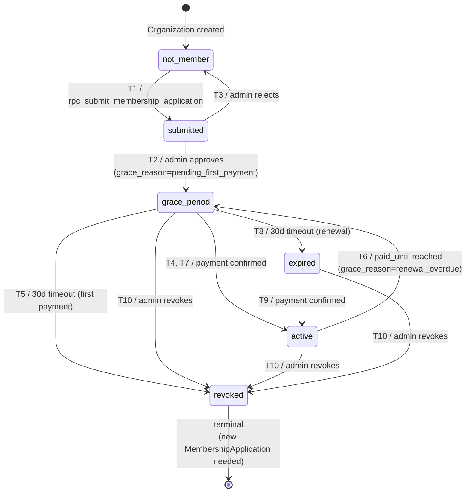

# Microstep 2 — AssociationMembership FSM v1.0
## AGOS Architecture Decision Record

| Field | Value |
|---|---|
| Date | 2026-05-14 |
| Status | ✅ Confirmed by CEO (Arshidin) |
| Builds on | M1 Identity v0.2 (`AssociationMembership` entity) |
| Replaces | Dok 6 v1.0 — `Membership.level` stack (`registered → observer → declared_supplier → standard_supplier`) |
| Scope | FSM состояний, переходов, авторитетов и метаданных для `AssociationMembership`. |
| Out of scope | Capability matrix per state (M3), Tier-specific capabilities, billing pricing, UI screens, RPC signatures. |
| Next | Microstep 3 — Capability matrix / FeatureGate seed |

---

## 0. TL;DR

- 4-уровневый стек уровней членства **удалён**. Модель **бинарная**: организация либо член, либо нет.
- 6 состояний FSM: `not_member`, `submitted`, `grace_period`, `active`, `expired`, `revoked`.
- 10 переходов.
- `grace_period` — единое состояние с `capabilities = ON` для двух кейсов (первая оплата после approve / просрочка продления). Семантику разводит поле `grace_reason`.
- `revoked` нерекуррентно (нужна новая заявка), `expired` рекуррентно (оплата восстанавливает доступ).
- Поле `tier` с default `'standard'` зарезервировано на будущее (premium tier — additive, не сейчас).

---

## 1. Что мы убрали и почему

В Dok 6 v1.0 закладывался уровневый стек:

```
registered → observer → declared_supplier → standard_supplier
```

Через семь вопросов и ответы CEO выяснилось:

- Уровни **не имеют смысла**, если не разблокируют разные capabilities. CEO подтвердил, что в обозримой перспективе все capabilities включаются единым пакетом (TSP, скидки, AI, зоо-вет).
- `observer` — технический промежуточный статус без бизнес-смысла. Если его можно пропустить — он не нужен в FSM.
- Возможная будущая разбивка на 2 tier'а (basic / premium) — это **подвиды active**, не отдельные уровни FSM.

**Решение:** членство бинарное. Tier — атрибут active-состояния, расширяемый через значение enum + строки в `FeatureGate`. Никаких изменений FSM не потребуется.

---

## 2. Состояния (6)

| State | Capabilities | Recoverable from | Semantics |
|---|---|---|---|
| `not_member` | OFF | — | Organization создана, заявка на членство не подана (или подавалась и была отклонена / откатилась). Дефолт. |
| `submitted` | OFF | — | Заявка `MembershipApplication` подана с приложенными документами, ждёт ревью админа TURAN. |
| `grace_period` | **ON** | — | Два под-кейса (см. `grace_reason`): (a) после approve, до первой оплаты; (b) после `paid_until`, окно продления 30 дней. |
| `active` | **ON** | — | Членский взнос оплачен, `paid_until` в будущем. Все capabilities включены. |
| `expired` | OFF | оплата → `active` | Просрочка > 30 дней (grace истёк) для членства, которое было активным. Рекуррентное состояние — оплата возвращает в active без нового approve. |
| `revoked` | OFF | новая `MembershipApplication` → `submitted` → ... | Дисциплинарное прекращение админом, или истечение 30-дневного grace для первой оплаты (approve не привёл к оплате). Нерекуррентное — нужно вступать заново. |

---

## 3. Переходы (10)

| # | From | To | Trigger | Authority | Side-effects |
|---|---|---|---|---|---|
| T1 | `not_member` | `submitted` | `rpc_submit_membership_application(org_id, documents[])` | Owner Organization | Создаётся запись `MembershipApplication(status=submitted)`. `AssociationMembership` запись ЕЩЁ НЕТ. |
| T2 | `submitted` | `grace_period` | Admin approves application | Admin TURAN | **Создаётся `AssociationMembership(state=grace_period, grace_reason='pending_first_payment', grace_until=approve_date+30d, tier='standard')`**. `MembershipApplication.status='approved'`. |
| T3 | `submitted` | `not_member` | Admin rejects application | Admin TURAN | `MembershipApplication.status='rejected'` (история). `AssociationMembership` НЕ создаётся. Org может подать новую заявку. |
| T4 | `grace_period (pending_first_payment)` | `active` | Payment confirmed (Kaspi webhook / manual admin confirm) | Billing | `paid_until = payment_date + membership_duration`. `grace_reason = NULL`. |
| T5 | `grace_period (pending_first_payment)` | `revoked` | `grace_until` reached, no payment | System (scheduled job) | `revoke_reason = 'first_payment_timeout'`. Org должна подать новую заявку, если хочет вступить. |
| T6 | `active` | `grace_period (renewal_overdue)` | `paid_until` reached, no renewal payment | System (scheduled job) | `grace_reason = 'renewal_overdue'`, `grace_until = paid_until + 30d`. Capabilities остаются ON. |
| T7 | `grace_period (renewal_overdue)` | `active` | Payment confirmed | Billing | `paid_until = payment_date + membership_duration`. `grace_reason = NULL`. |
| T8 | `grace_period (renewal_overdue)` | `expired` | `grace_until` reached, no payment | System (scheduled job) | Capabilities OFF. Org может восстановить оплатой (T9). |
| T9 | `expired` | `active` | Payment confirmed | Billing | `paid_until = payment_date + membership_duration`. Без нового approve. |
| T10 | `{active, grace_period, expired}` | `revoked` | Admin revokes | Admin TURAN | `revoke_reason = 'disciplinary' \| '...'`. Org должна подать новую заявку, если хочет вступить заново. |

**Заметки про T2, T5, T10:**

- T2 — критический переход: именно здесь создаётся запись `AssociationMembership` (до этого её не было). До approve membership как сущность не существует — есть только заявка. Это важно для аналитики: «количество членов» = COUNT(AssociationMembership), не зависит от submitted-заявок.
- T5 vs T10 — оба ведут в `revoked`, но по разным причинам. Различает поле `revoke_reason`. T5 = автоматическое (timeout), T10 = ручное (админ).
- T10 — admin может revoke из любого состояния, где membership существует (active / grace_period / expired). Из not_member и submitted нельзя — там нечего отзывать.

---

## 4. Метаданные на состояниях

### 4.1. На `grace_period`

Чтобы одно состояние обслуживало два семантически разных кейса, FSM хранит:

```
AssociationMembership.grace_reason ENUM(
  'pending_first_payment',  -- T2 → grace
  'renewal_overdue'         -- T6 → grace
)
AssociationMembership.grace_until DATE NOT NULL
```

**UX-импликации (для M5/UI-микрошагов, не для FSM):**
- `pending_first_payment` → копи «Оплатите членский взнос, чтобы активировать членство. Осталось N дней.»
- `renewal_overdue` → копи «Ваш членский взнос истёк. Продлите, чтобы не потерять доступ. Осталось N дней.»

Capabilities в обоих случаях одинаковые — **включены**.

### 4.2. На `active`

```
AssociationMembership.tier TEXT DEFAULT 'standard' NOT NULL
AssociationMembership.paid_until DATE NOT NULL
```

В MVP `tier = 'standard'` всегда. Будущий `'premium'` — добавляется как значение enum, новые строки в `FeatureGate` с `org_membership_tier_required = 'premium'`. Никаких изменений FSM.

### 4.3. На `expired` и `revoked`

```
AssociationMembership.revoke_reason TEXT NULL
-- При T5: 'first_payment_timeout'
-- При T10: 'disciplinary' | 'voluntary' (в будущем) | свободный текст админа
```

`expired` не требует поля reason — причина всегда одна (просрочка после grace).

---

## 5. Authority matrix (кто инициирует переходы)

| Authority | Переходы | Note |
|---|---|---|
| **Owner Organization** | T1 | Только submit. Нельзя «активировать», «оплатить за организацию» в обход billing. |
| **Admin TURAN** | T2, T3, T10 | Approve, reject, revoke. Зеркало внешнего процесса ассоциации. |
| **Billing** (Kaspi webhook / manual admin confirm) | T4, T7, T9 | Любое подтверждение оплаты → перевод в active. |
| **System (scheduled job)** | T5, T6, T8 | Истечение grace / paid_until. Запускается ежедневно cron'ом. |

**Антипаттерны, которые этот матрикс блокирует:**
- Owner не может сам себе approve.
- Admin не может пометить оплату прошедшей (это создавало бы коррупционный риск; manual confirm идёт через billing path, не через admin override).
- System ничего сама не approve / не reject — только timeouts.

---

## 6. Параллельная FSM — `MembershipApplication`

`MembershipApplication` — append-only история заявок. Имеет свою короткую FSM:

```
draft → submitted → {approved | rejected}
```

- `draft` — фермер начал заполнять, но ещё не отправил.
- `submitted` — отправлено, ждёт ревью.
- `approved` / `rejected` — terminal состояния.

**Принципы:**
- Каждая попытка вступить = отдельная запись `MembershipApplication` (audit trail). Reject не удаляет историю.
- На `Organization` в каждый момент может быть **одна active** (`draft` или `submitted`) `MembershipApplication` — нельзя подать вторую, пока не закрыта первая.
- После terminal статуса (approved или rejected) можно создавать новую заявку.

**Связь с `AssociationMembership`:**
- При T2 (approve): `MembershipApplication.status = 'approved'`, создаётся `AssociationMembership`.
- При T3 (reject): `MembershipApplication.status = 'rejected'`, `AssociationMembership` НЕ создаётся.
- При T10 (revoke): `AssociationMembership.state = 'revoked'`, новая заявка для возврата.

---

## 7. Temporal model (Principle 12)

| Поле | Тип | Когда обновляется |
|---|---|---|
| `AssociationMembership.created_at` | TIMESTAMP | T2 |
| `AssociationMembership.state` | ENUM | каждый переход |
| `AssociationMembership.state_changed_at` | TIMESTAMP | каждый переход |
| `AssociationMembership.grace_reason` | ENUM NULL | T2, T6 → SET; T4, T7, T9 → NULL |
| `AssociationMembership.grace_until` | DATE NULL | T2, T6 → SET; T4, T7, T9 → NULL |
| `AssociationMembership.paid_until` | DATE NULL | T4, T7, T9 |
| `AssociationMembership.revoke_reason` | TEXT NULL | T5, T10 |
| `AssociationMembership.tier` | TEXT | T2 (default 'standard') |

**История переходов** хранится в отдельной таблице `MembershipStateTransition` (append-only лог) — параллель `SubscriptionEvent` из M1. Это нужно для аналитики, аудита и недоверчивых вопросов «когда именно нас выкинули из членов».

---

## 8. Key Decisions

### D-MEM-1 — Бинарная модель членства

**Что:** Удалён уровневый стек. Членство либо есть (`active`/`grace_period`), либо нет (`not_member`/`expired`/`revoked`).
**Почему:** Уровни не разблокировали разные capabilities. CEO подтвердил, что весь пакет включается единым шагом.
**Последствия:** Меньше состояний, проще capability matrix, проще UI. Tier-вариативность (basic/premium) отложена и реализуема additive.

### D-MEM-2 — `grace_period` обслуживает два кейса через `grace_reason`

**Что:** Approve без оплаты и просрочка продления = одно FSM-состояние с метаданными.
**Почему:** Унифицированная транзитивная логика (одно правило: «30 дней или revoke/expired»). Capabilities одинаковые. UX-копии разные — это UI-вопрос, не FSM.
**Последствия:** FSM компактнее. Capability matrix не различает причину grace — упрощение M3. UX-копи разводятся в M5.

### D-MEM-3 — A2-soft: capabilities ON в обоих grace-кейсах

**Что:** После approve фермер получает 30-дневный доступ к capabilities до первой оплаты. После просрочки — продолжает иметь доступ ещё 30 дней.
**Почему:** Высокий стимул к оплате (попробовал TSP — захотел сохранить). Симметрия UX. Анти-trust чистота (approve = одобренное решение, доступ оправдан).
**Альтернативы:** A2-strict (выключены везде) — отвергнуто как demotivating. A2-asymmetric — отвергнуто как маскировка A1 через метаданные.

### D-MEM-4 — Reject возвращает в `not_member`, не создаёт state `rejected`

**Что:** Откло́нение не порождает FSM-состояние `rejected` на AssociationMembership. Состояние Organization откатывается в `not_member`. Историю отказа хранит `MembershipApplication.status='rejected'`.
**Почему:** Самая чистая семантика — «как будто не подавал». Меньше состояний в FSM. История присутствует там, где должна — в Application audit trail.
**Последствия:** Можно подавать повторно сколько угодно раз. Каждая попытка — отдельная запись Application.

### D-MEM-5 — `expired` рекуррентно, `revoked` нерекуррентно

**Что:**
- `expired` — оплата возвращает в `active` без нового approve.
- `revoked` — оплата НЕ восстанавливает. Нужна новая `MembershipApplication` → новый review → новый approve → новый grace_period.

**Почему:** Семантика разная. Expired = «забыл заплатить, исправь». Revoked = «есть причина, нужен пересмотр». Объединение их в один state скрыло бы это различие.
**Последствия:** UI и admin-операции разные. Restore из expired — фермер сам через payment. Restore из revoked — заявка + ревью.

### D-MEM-6 — Tier как атрибут active, не FSM-состояние

**Что:** `AssociationMembership.tier TEXT DEFAULT 'standard'`. В MVP всегда 'standard'. Premium/etc. — добавляется как enum-значение + строки в FeatureGate.
**Почему:** Tier — это про capabilities (M3), не про lifecycle. Включать в FSM значило бы дублировать. Архитектурно правильнее держать lifecycle минимальным.
**Последствия:** FSM остаётся 6-состояний независимо от количества будущих tier'ов. Premium → standard переход (downgrade) — будет реализован как UPDATE tier-поля, не как FSM-transition.

### D-MEM-7 — Voluntary withdrawal не реализуется в MVP

**Что:** Нет состояния `withdrawn`. Если фермер хочет уйти добровольно — пишет в саппорт, админ revokes с `revoke_reason='voluntary'`.
**Почему:** Не было реального кейса. Не блокирует MVP.
**Последствия:** Если кейс возникнет — добавим состояние или валидное значение `revoke_reason`. Additive.

---

## 9. Mermaid stateDiagram (для FigJam / документации)



---

## 10. Impact на текущий Dok 6 v1.0

| Что в Dok 6 v1.0 | Что становится |
|---|---|
| `Membership.level: registered \| observer \| declared_supplier \| standard_supplier` | `AssociationMembership.state: not_member \| submitted \| grace_period \| active \| expired \| revoked` + `tier='standard'` |
| F25 «Welcome / select intent» содержит уровневую логику | Просто intent-выбор, нет уровней |
| F26 «Membership application» с выбором уровня | Просто заявка (без выбора уровня) с приложением документов |
| Capabilities привязаны к уровню (declared_supplier → TSP unlock) | Capabilities привязаны к bool (state ∈ {active, grace_period}) + tier (на будущее, MVP только standard) |
| Нет grace-механики | grace_period с двумя reason'ами и 30-дневным таймером |
| Revoke не описан | T10 явно, отдельный non-recurrent terminal |

---

## 11. Open Questions (перенесённые / новые)

| ID | Вопрос | Микрошаг |
|---|---|---|
| Q-MEM-DURATION | Какова стандартная продолжительность членства? (год? полугодие? на конкретную дату — конец календарного года?) Это определяет, как считается `paid_until = payment_date + ?`. | Биллинговая сессия |
| Q-MEM-DOCS | Какие именно документы прикладываются к `MembershipApplication`? (Устав, БИН, справка о деятельности?) | M5 (онбординг) |
| Q-MEM-FEE | Размер членского взноса. Зависит ли от региона / размера хозяйства / tier'а? | Биллинговая сессия |
| Q-MEM-NOTIFICATIONS | Когда система шлёт фермеру напоминание о приближающемся истечении grace / paid_until? (за 7, 3, 1 день?) | UX / нотификации |
| Q-MEM-ADMIN-VIEW | Какие фильтры/поиск нужны админу TURAN для работы с потоком submitted и expiring? | Admin UI микрошаг |
| Q-PRIMARY-TYPE (carry-over from M1) | Может ли первичный `OrganizationType` быть сменён? | M3 |
| Q-PRO-FEATURES (carry-over from M1) | Конкретный feature set Pro-тира | M3 |

---

## 12. Не делать в Microstep 3

- SQL DDL для AssociationMembership / MembershipApplication
- Дизайн экранов F25/F26/F26a
- Текст admin-уведомлений и фермер-баннеров
- RPC signatures
- Уровневая структура (она удалена — см. D-MEM-1)
- Биллинговые цены и сроки

**Только M3:** Capability matrix — реестр `FeatureGate` с указанием для каждой фичи: `user_tier_required`, `org_membership_required` (= `'active'` / `'active_or_grace'` / `null`), `org_membership_tier_required` (на будущее), `org_type_required[]`.
