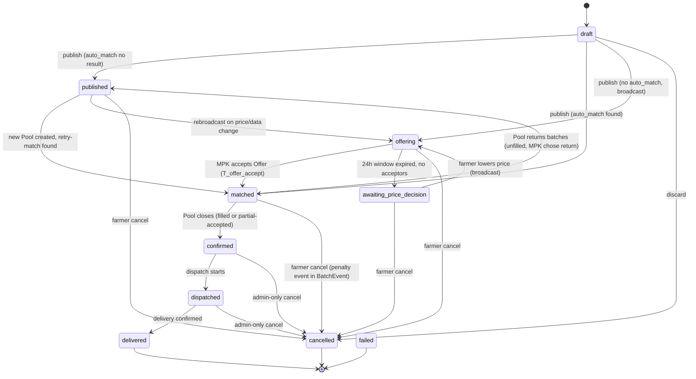
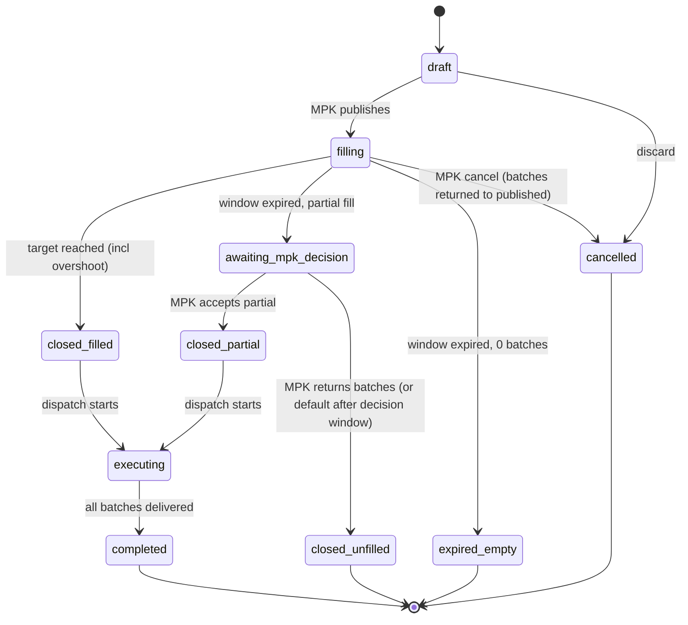
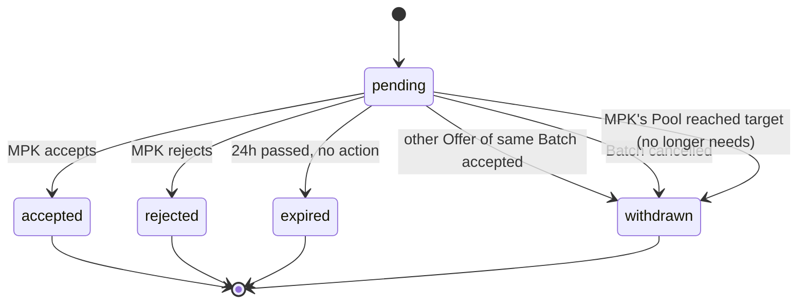

# Microstep 4 — Batch / Pool / Offer Model v1.0
## AGOS Architecture Decision Record

| Field | Value |
|---|---|
| Date | 2026-05-16 |
| Status | ✅ Confirmed by CEO (Arshidin) |
| Builds on | M1 Identity v0.2, M2 AssociationMembership FSM v1.0, M3 Feature Governance v1.0 |
| Replaces | Dok 1 §5 entities `PoolRequest`, `PoolMatch`, `PoolManifest`; d02_tsp.sql lifecycle assumptions (partial); Dok 6 F26–F28 farmer Pool/Batch screens (state definitions only — UI in M6) |
| Scope | Сущности торгов на TSP (Batch / Pool / Offer + поддерживающие), их FSM, модель ценообразования и matching, проекция в фермерский язык. |
| Out of scope | UI экраны (M6), tonkий копирайт, RPC sygnatures, конкретные значения reference price, точные правила derive_category (зависит от утверждённого классификатора). |
| Next | Microstep 5 — Onboarding flow |

---

## 0. TL;DR

- **Pool = PoolRequest = одна сущность.** Иницируется только МПК. `PoolRequest` как отдельная сущность ликвидируется (поглощается в `Pool`). Никакого «контейнера исполнения после матча» — это последующие состояния того же объекта.
- **Связь:** `Batch : Pool = many : one`. Один Batch может быть в максимум одном Pool. `Batch.pool_id` FK nullable.
- **Цена устанавливается обеими сторонами при публикации, не на этапе сделки.** МПК — с **hard floor** по защитной цене категории. Фермер — с **soft warning**. Никаких переговорных раундов.
- **Auto-match при публикации Batch** ищет лучшее предложение МПК (highest price ≥ farmer's), tiebreak — FIFO по дате создания Pool.
- **Broadcast-механика:** если auto-match не найден — система рассылает **Offer** (отдельная сущность) каждому подходящему МПК. FCFS 24h, окно конфигурируемо ассоциацией.
- **Понижение цены:** после истечения Offer-окна без taker — фермер уведомлён, шаг понижения цены задан ассоциацией (один %, не по категориям). Цикл до сделки или отзыва.
- **Pool закрывается автоматически при достижении target_volume.** Overshoot принимается (последний Batch не дробится).
- **Если окно истекло, target не достигнут** — МПК выбирает: вернуть батчи в `published` или согласиться на частичное исполнение по факту собранных.
- **Сделка = момент закрытия Pool, не момент match.** До закрытия Batch висит «подтверждён» (нашёлся покупатель, ждём заполнения).
- **Категория** выводится автоматически из (порода + вес + возраст + кондиция) — фермер её не выбирает. Классификатор версионируется.
- **Reference price** — устанавливается ассоциацией вручную, периодически обновляется. Auto-расчёт отложен.

---

## 1. Сущности

### 1.1. Каталог сущностей TSP-домена

| Сущность | Назначение | Кто создаёт | Cardinality |
|---|---|---|---|
| `Batch` | Партия скота, выставленная фермером на продажу | Farmer Organization owner | many → Organization (farmer) |
| `Pool` | Заявка МПК на закупку (она же контейнер исполнения) | MPK Organization owner | many → Organization (mpk) |
| `Offer` | Индивидуальное обращение Batch → MPK с предложением цены (broadcast-механика) | System (auto-generated при no-match) | many → Batch, many → Organization(mpk). M:N pair via Offer record. |
| `LivestockCategory` | Справочник категорий скота (выводимая) | Seed-data / Admin TURAN | — |
| `LivestockCategoryRule` | Правила вывода категории из (порода, вес, возраст, кондиция) | Admin TURAN | many → LivestockCategory |
| `ReferencePrice` | Рекомендованная цена платформы по категории, версионируемая | Admin TURAN (manual) | many → LivestockCategory |
| `MinimumPrice` | Защитная минимальная цена по категории | Admin TURAN | many → LivestockCategory |
| `BatchEvent` | Append-only лог событий по Batch (для аудита и будущего рейтинга) | Internal | many → Batch |
| `PoolEvent` | Append-only лог событий по Pool | Internal | many → Pool |
| `OfferEvent` | Append-only лог по Offer | Internal | many → Offer |

### 1.2. Что удалено / переименовано из Dok 1 и d02_tsp.sql

| Было | Стало | Причина |
|---|---|---|
| `PoolRequest` (отдельная сущность) | поглощается в `Pool` | Pool=PoolRequest по решению CEO 2026-05-16 |
| `PoolMatch` | удалена | факт «Batch в Pool» = `Batch.pool_id IS NOT NULL`. Match как отдельный объект не нужен. |
| `PoolManifest` | переосмыслить или удалить | вероятно станет производным view для отчёта по закрытому Pool. Решение отложено в backend-имплементацию. |
| Concept «Pool создаётся платформой автоматически по накоплению» | удалён | Pool создаёт только МПК. Никаких platform-initiated Pools. |

### 1.3. Что добавлено

- `Offer` — новая сущность для broadcast-механики.
- `LivestockCategoryRule` — правила derive_category. Раньше предполагалось, что категория = свободный enum или fk без правил вывода.
- `MinimumPrice` — отдельно от `ReferencePrice`. Hard floor и индикатив — два разных значения.

---

## 2. Модель ценообразования и matching

### 2.1. Принципы

1. **Платформа не устанавливает сделочную цену.** Reference price — индикатив, не обязательство.
2. **MinimumPrice — антитраст и защита фермеров.** Это standards ассоциации, не координация цен (ст. 171 ПК РК).
3. **Цены фиксируются обеими сторонами ДО матчинга.** Никаких переговорных раундов post-match.
4. **Best execution для фермера.** При множественных matching Pool — выбирается тот, где МПК платит больше.
5. **Broadcast — единственный фолбэк** при отсутствии auto-match. Никакого «висит и ждёт».

### 2.2. Алгоритм matching (при публикации Batch)

```
function publish_batch(batch):
  if batch.farmer_price < minimum_price(batch.category):
    show_warning_to_farmer("ниже защитной цены")
    require_explicit_confirmation()

  # шаг 1: поиск подходящих pools
  candidates = SELECT * FROM pool
    WHERE state = 'filling'
      AND category = batch.category
      AND region overlaps batch.region
      AND mpk_price >= batch.farmer_price            -- цена МПК покрывает фермера
      AND remaining_capacity >= batch.head_count     -- по объёму
      AND (any_other_filters: e.g. delivery_date)

  # шаг 2: tiebreak
  if candidates IS NOT EMPTY:
    winning_pool = candidates
      ORDER BY mpk_price DESC,           -- лучшее предложение МПК
               created_at ASC            -- FIFO для ничьей
      LIMIT 1

    atomic transaction:
      batch.pool_id = winning_pool.id
      batch.state = 'matched'
      batch.deal_price = winning_pool.mpk_price   -- фермер получает больше, чем просил
      winning_pool.filled_volume += batch.head_count
      IF winning_pool.filled_volume >= winning_pool.target_volume:
        close_pool(winning_pool)                   -- см. 2.4
    return

  # шаг 3: no match → broadcast
  matching_mpks = SELECT DISTINCT organization_id FROM pool
    WHERE state = 'filling'
      AND category = batch.category
      AND region overlaps batch.region
      AND remaining_capacity >= batch.head_count
      # ВАЖНО: даже если mpk_price < farmer_price, шлём оффер

  if matching_mpks IS NOT EMPTY:
    for each mpk in matching_mpks:
      create_offer(batch, mpk, batch.farmer_price, expires_at=now + offer_window)
    batch.state = 'offering'
    return

  # шаг 4: нет ни pool ни МПК
  batch.state = 'published'
  return
```

**Заметки:**
- На шаге 3 Offers идут МПК **независимо от их собственной цены в Pool** — фермер предлагает выше, но кто-то из МПК может согласиться, чтобы быстрее закрыть пул.
- Шаг 4: Batch висит в `published` без событий. При появлении нового Pool — система запускает retry matching для висящих Batch'ей.

### 2.3. Алгоритм когда МПК принимает Offer

```
function accept_offer(offer, mpk_user):
  if offer.state != 'pending' OR offer.expires_at < now:
    fail("Offer expired or unavailable")

  atomic transaction:
    offer.state = 'accepted'

    # все остальные Offers того же Batch — withdraw
    UPDATE offer SET state='withdrawn'
      WHERE batch_id = offer.batch_id
        AND id != offer.id
        AND state = 'pending'

    # Batch matched в Pool этого МПК
    target_pool = mpk's matching Pool by category+region
    batch.pool_id = target_pool.id
    batch.state = 'matched'
    batch.deal_price = offer.offered_price            # цена фермера, не Pool'а

    target_pool.filled_volume += batch.head_count
    IF target_pool.filled_volume >= target_pool.target_volume:
      close_pool(target_pool)
```

**Важно:** в этом сценарии `deal_price = offer.offered_price` (цена фермера), а не цена Pool. Потому что МПК согласился на более высокую цену.

### 2.4. Закрытие Pool

```
function close_pool(pool):
  atomic transaction:
    pool.state = 'closed_filled'
    pool.closed_at = now

    # все matched Batch — переходят в confirmed
    UPDATE batch SET state='confirmed'
      WHERE pool_id = pool.id AND state = 'matched'

    # все висящие Offers, идущие к МПК этого Pool по этой категории — withdraw
    # (МПК набрал, ему больше не нужно)
    UPDATE offer SET state='withdrawn'
      WHERE mpk_org_id = pool.organization_id
        AND state = 'pending'
        AND offer.batch.category = pool.category
        AND offer.batch.pool_id IS NULL
```

**Overshoot:** если последний Batch вызвал `filled_volume > target_volume` — Pool всё равно закрывается, лишний объём принимается. Это `Q-NEW-3a` решение: Batch принимается целиком.

### 2.5. Истечение окна Pool без достижения target

```
function pool_window_expires(pool):
  if pool.filled_volume == 0:
    pool.state = 'expired_empty'
    return

  if pool.filled_volume < pool.target_volume:
    pool.state = 'awaiting_mpk_decision'
    notify_mpk("Окно истекло. Набрано X из Y. Решите: вернуть батчи и закрыть, или согласиться на частичное исполнение.")
    # МПК имеет N часов на решение (конфигурируется)
    schedule_default_action(pool, after=mpk_decision_window, default='return_batches')
```

МПК имеет два варианта:

**Вариант A: вернуть батчи в published.**
```
function pool_mpk_returns_batches(pool):
  atomic transaction:
    pool.state = 'closed_unfilled'

    # все matched Batch возвращаются
    UPDATE batch SET pool_id=NULL, state='published', deal_price=NULL
      WHERE pool_id = pool.id AND state = 'matched'

    # уведомление фермерам
    for each affected batch: emit batch.unmatched_due_to_pool_failure
```

**Вариант B: согласие на частичное исполнение.**
```
function pool_mpk_accepts_partial(pool):
  atomic transaction:
    pool.state = 'closed_partial'
    pool.target_volume = pool.filled_volume  # принимаем то, что есть
    # все matched Batch → confirmed
    UPDATE batch SET state='confirmed' WHERE pool_id = pool.id AND state = 'matched'
```

**Дефолтное действие** при отсутствии решения МПК в окно — **вариант A** (вернуть). Это farmer-friendly: фермер не висит в подвешенном состоянии бесконечно.

### 2.6. Понижение цены фермером

```
function on_offer_window_expired_no_acceptors(batch):
  # все Offers истекли, никто не согласился
  current_price = batch.farmer_price
  step_pct = association_config.price_step_down_pct  # один % для всех категорий
  suggested_price = current_price * (1 - step_pct / 100)

  notify_farmer(
    "Ваше предложение отклонено всеми покупателями. Рекомендуем снизить цену до X.",
    actions=['accept_suggested', 'set_custom', 'cancel_batch']
  )
  batch.state = 'awaiting_price_decision'
```

Фермер реагирует через RPC:

- **accept_suggested:** новая цена = suggested_price, broadcast Offers заново.
- **set_custom(new_price):** валидируется (≥ floor warning), broadcast Offers заново.
- **cancel_batch:** Batch → cancelled.

---

## 3. FSM `Batch`

### 3.1. Состояния (10)

| State | Значение | Capabilities |
|---|---|---|
| `draft` | Черновик, не опубликован | Только редактирование, удаление |
| `published` | Опубликован, не сматчен, ждёт появления подходящего Pool | Можно отозвать (→ cancelled), редактировать (с rebroadcast) |
| `offering` | Offers разосланы МПК, ждём ответа | Только cancel |
| `awaiting_price_decision` | Offer-окно истекло без taker, ждём решения фермера | Cancel, lower price |
| `matched` | Нашёлся покупатель (auto или через Offer), Batch в Pool, ждёт закрытия Pool | Cancel с пометкой «cancelled_after_match» (Q-NEW-7) |
| `confirmed` | Pool закрылся, сделка зафиксирована, готовим исполнение | Cancel только через админа (см. Q-BATCH-4 / 11a) |
| `dispatched` | Отгрузка началась | Cancel только админ |
| `delivered` | Доставлено | Terminal позитивный |
| `cancelled` | Отменён фермером (или админом) | Terminal негативный |
| `failed` | Системная ошибка (например, Pool fail и нет retry) | Terminal негативный |

### 3.2. Mermaid diagram



### 3.3. Переходы — расширенная таблица

| # | From | To | Trigger | Authority | Side effects |
|---|---|---|---|---|---|
| BT-01 | draft | matched | publish + auto-match found | Farmer owner | Batch.pool_id set, Batch.deal_price = winning_pool.mpk_price, pool.filled_volume +=, close_pool if reached |
| BT-02 | draft | offering | publish + no auto-match + has matching MPKs | Farmer owner | N Offers created (pending, expires_at = now + offer_window) |
| BT-03 | draft | published | publish + no MPKs at all | Farmer owner | — |
| BT-04 | draft | cancelled | discard | Farmer owner | — |
| BT-05 | published | matched | new Pool created → retry-match found | System (Pool publish trigger) | Same as BT-01 |
| BT-06 | published | offering | farmer edits price/data, rebroadcast | Farmer owner | Offers (re)issued |
| BT-07 | published | cancelled | farmer cancel | Farmer owner | — |
| BT-08 | offering | matched | MPK accepts one Offer | MPK user | Offer.accepted, other Offers → withdrawn, Batch → matched in MPK's Pool, deal_price = offer_price |
| BT-09 | offering | awaiting_price_decision | all Offers expired | System (scheduled job) | Farmer notified with suggested price |
| BT-10 | offering | cancelled | farmer cancel | Farmer owner | All Offers → withdrawn |
| BT-11 | awaiting_price_decision | offering | farmer lowers price | Farmer owner | New Offers broadcast at new price |
| BT-12 | awaiting_price_decision | cancelled | farmer cancel | Farmer owner | — |
| BT-13 | matched | confirmed | Pool closes (filled, overshoot, or partial-accepted) | System (in close_pool transaction) | — |
| BT-14 | matched | published | Pool window expired, MPK chose 'return_batches' | System (in pool_mpk_returns_batches) | pool_id = NULL, deal_price = NULL |
| BT-15 | matched | cancelled | farmer cancel after match (Q-NEW-7) | Farmer owner | BatchEvent(type='cancelled_after_match') for future rating |
| BT-16 | confirmed | dispatched | dispatch starts | MPK / logistics | — |
| BT-17 | confirmed | cancelled | admin-only cancel | Admin TURAN | BatchEvent(type='cancelled_during_execution') |
| BT-18 | dispatched | delivered | delivery confirmed | MPK acknowledges receipt | — |
| BT-19 | dispatched | cancelled | admin-only cancel | Admin TURAN | — |

---

## 4. FSM `Pool` (MPK's perspective; backend canonical)

### 4.1. Состояния

| State | Значение |
|---|---|
| `draft` | МПК заполняет, не опубликовал |
| `filling` | Опубликован, ждёт батчи. Окно открыто. |
| `awaiting_mpk_decision` | Окно истекло, target не достигнут. МПК должен решить (вернуть или партиал) |
| `closed_filled` | Target достигнут (с возможным overshoot), батчи переведены в confirmed, готовы к dispatch |
| `closed_partial` | МПК согласился на партиал |
| `closed_unfilled` | МПК вернул батчи (или дефолт после окна) |
| `executing` | Dispatch начат |
| `completed` | Все батчи delivered |
| `cancelled` | МПК отменил до закрытия |
| `expired_empty` | Окно истекло, не было ни одного Batch |

### 4.2. Mermaid



### 4.3. Авторитеты переходов

| Authority | Переходы |
|---|---|
| MPK owner | publish (draft→filling), cancel, accept_partial, return_batches |
| System (scheduled) | window expiration, default fallback (return_batches if MPK doesn't decide) |
| System (Batch added) | target check → close_filled |
| Logistics actor (MPK side) | dispatch, delivery confirmation |

---

## 5. FSM `Offer`

### 5.1. Состояния

| State | Значение |
|---|---|
| `pending` | Создан, ждёт ответа МПК |
| `accepted` | МПК принял (terminal, превращается в match) |
| `rejected` | МПК явно отклонил (terminal) |
| `expired` | Окно истекло без ответа (terminal) |
| `withdrawn` | Закрыт системой (другой Offer принят / Batch отменён / Pool МПК набрал) |

### 5.2. Mermaid



---

## 6. Поддерживающие сущности

### 6.1. `LivestockCategory` и derive_category

**Принципы:**
- Категория — **выводимая** характеристика, фермер её не выбирает.
- Классификатор **версионируется** (`version`, `effective_from`, `effective_to`).
- При публикации Batch — фиксируется конкретная версия классификатора, **новые версии не пересмэтчивают старые батчи**.

**Структура (отложено в SQL imp):**

```sql
livestock_category (
  id, code, display_name,
  version, effective_from, effective_to
)

livestock_category_rule (
  id, category_id,
  breed_class TEXT[],     -- 'beef', 'dairy', 'dual', 'any'
  age_min_months, age_max_months,
  weight_min_kg, weight_max_kg,
  condition TEXT[],       -- e.g. ['fattening', 'finished']
  priority INT            -- для разрешения конфликтов
)
```

**derive_category(breed_id, age, weight, condition) → category_id**

Функция перебирает rules по приоритету, возвращает первый match. Если совпадений нет — `unknown_category` (Batch не публикуется, фермеру предлагают обратиться в админ для расширения классификатора).

### 6.2. `ReferencePrice`

```sql
reference_price (
  id, category_id,
  price_per_kg DECIMAL,
  set_by UUID,            -- админ TURAN
  effective_from DATE,
  effective_to DATE,
  notes TEXT
)
```

Записи активные = `effective_from <= today AND (effective_to IS NULL OR effective_to >= today)`. На каждую категорию в каждый момент должна быть только одна активная запись.

### 6.3. `MinimumPrice`

Аналогично `ReferencePrice`, отдельная таблица. Хранится отдельно от reference, потому что семантически разное: reference = «индикатив», minimum = «защитная».

### 6.4. `BatchEvent`, `PoolEvent`, `OfferEvent`

Append-only логи. Минимальная структура:

```sql
batch_event (
  id, batch_id, event_type, occurred_at, actor_id, metadata JSONB
)
```

**Типы событий для Batch:**
- `created`, `published`, `matched_auto`, `matched_via_offer`, `confirmed`, `cancelled_before_match`, `cancelled_after_match`, `cancelled_during_execution`, `dispatched`, `delivered`, `price_lowered`, `returned_to_published_after_pool_fail`

Это **основа для будущего рейтинга** фермеров и МПК. Никаких отдельных rating-таблиц — рейтинг вычисляется как aggregation over events.

---

## 7. Фермерская проекция (vocabulary)

**Принцип (закреплён в M1):** в фермерском UI слова `Pool`, `Offer`, `match` НЕ используются. Backend-сущности остаются, UI работает в фермерском словаре.

### 7.1. Маппинг состояний Batch → фермерский язык

| Backend state | Фермерский UI label (предложение, M6 финализирует) |
|---|---|
| draft | «Черновик» |
| published | «Опубликовано — ждём покупателя» |
| offering | «Отправлено покупателям — ждём согласия» |
| awaiting_price_decision | «Покупатели не согласились — что делаем дальше?» |
| matched | «Нашёлся покупатель — ждём подбора партии» |
| confirmed | «Подтверждено — готовим отгрузку» |
| dispatched | «В пути» |
| delivered | «Доставлено» |
| cancelled | «Отменено» |

### 7.2. Что фермер НЕ видит

- Какой именно Pool, какой МПК (до конкретной стадии). На стадии `matched` — видит МПК. На стадиях до — нет.
- Какие конкретно Offers были разосланы. Видит общую формулировку «отправлено покупателям».
- Состояние Pool. Видит свою партию, не пул.
- Понятие «pool target volume», «filled volume», «overshoot».
- Внутренние FSM transitions.

### 7.3. Что фермер видит дополнительно

- **Reference price** при создании Batch — «средняя цена на платформе по такой категории — X ₸/кг».
- **Soft warning** при цене ниже минимума — «вы продаёте ниже защитной цены ассоциации, рекомендуем X».
- **Suggested step-down price** при истечении Offers — «рекомендуем снизить до Y ₸/кг».
- **Notification** при возврате батча в `published` после fail Pool — «покупатель не набрал нужный объём, ваша партия снова в продаже».

---

## 8. Антитраст-чистота (ст. 171 ПК РК)

Архитектура **не допускает** следующих действий:

1. **Платформа не устанавливает цену сделки.** `Batch.deal_price` всегда выводится из farmer_price или mpk_price, никогда не из reference_price.
2. **Reference price — индикатив.** UI копи прямо говорит «рекомендуемая», «средняя», не «обязательная».
3. **MinimumPrice — защита, не координация.** Это **floor**, не «цена сговора». Применяется только к МПК (запрет хищнического demping), для фермеров — soft warning.
4. **МПК не видит цены друг друга** до момента собственной публикации. Reference price скрывает.
5. **Фермер не видит цены других фермеров** в реальном времени (только aggregated history через reference price).
6. **Offers идут МПК независимо** — каждый принимает решение в собственном UI без знания о других.
7. **Multi-type Organization** не может одновременно быть продавцом и покупателем в одном Pool (gate на уровне OrganizationTypeAssignment).

---

## 9. Key Decisions

### D-TSP-1 — Pool = единая сущность

`Pool` поглощает `PoolRequest`. Никакого «контейнера исполнения, отдельного от заявки». Один объект, проходящий через все стадии.

### D-TSP-2 — Batch:Pool = many:one (FK на Batch)

Один Batch может быть в максимум одном Pool. Связь через `Batch.pool_id`. M:N таблица-связка не нужна.

> **Superseded by M6 D-M6-13:** Batch links to pool_line (batch.pool_line_id), not Pool directly.

### D-TSP-3 — Цена фиксируется обеими сторонами при публикации

Ни Batch, ни Pool без цены не существуют. Никаких «договоримся потом». Это снимает класс багов с переговорными раундами.

### D-TSP-4 — Hard floor для МПК, soft warning для фермера

Защитная цена работает асимметрично. МПК не может опубликовать ниже. Фермер может, с предупреждением. Реализация — на двух разных RPC.

### D-TSP-5 — Auto-match по best execution для фермера

При множественных matching Pools — выбирается с самой высокой ценой МПК. Tiebreak — FIFO по дате Pool. `deal_price = mpk_price` (фермер получает больше, чем просил).

### D-TSP-6 — Broadcast Offer при отсутствии auto-match

Если фермерская цена выше всех Pool — система рассылает Offers всем подходящим МПК независимо от их собственной цены. FCFS 24ч.

### D-TSP-7 — Offer как отдельная сущность

Каждое индивидуальное обращение Batch → MPK — отдельная запись с FSM. Это даёт audit trail и основу для рейтинга. Альтернатива (broadcast как состояние Batch) отвергнута.

### D-TSP-8 — Понижение цены — фермерское решение, шаг — ассоциация

После истечения Offers — фермер решает (понизить / отозвать). Процент снижения задаётся ассоциацией единый для всех категорий. Никаких авто-снижений без согласия.

### D-TSP-9 — Pool закрывается автоматом при достижении target, overshoot принимается

Последний Batch не дробится. Если итог > target — МПК принимает излишек. Это упрощает FSM и UX.

### D-TSP-10 — Underfilled Pool → MPK решает

Если окно истекло, target не достигнут — МПК между двумя вариантами: вернуть батчи или согласиться на партиал. Default (если МПК не отреагировал в decision-окне) — вернуть.

### D-TSP-11 — Сделка = момент закрытия Pool, не момент match

До закрытия Pool — Batch в `matched` («подтверждён, ждём заполнения»). После закрытия — `confirmed` («сделка фиксирована»). Только из `confirmed` начинается dispatch.

### D-TSP-12 — Категория выводится из (порода + вес + возраст + кондиция)

Фермер не выбирает категорию. Снижение когнитивной нагрузки. Классификатор версионируется, attached к Batch при публикации (не пересчитывается на лету).

### D-TSP-13 — Reference price = ручная установка ассоциацией

В MVP. Автоматический расчёт (от истории сделок) отложен до достаточной data accumulation. Standards as data — обновляется INSERT/UPDATE, не code deploy.

### D-TSP-14 — Cancel-after-match = event в BatchEvent

Фермерская отмена после матча — разрешена, записывается в BatchEvent с типом `cancelled_after_match`. Основа для будущего рейтинга. Никаких финансовых пенальти в MVP.

### D-TSP-15 — Cancel-after-confirmed только через админа

Когда Pool закрылся и сделка фиксирована — фермер сам отозвать не может. Только админ TURAN, по обоснованному обращению. Защищает МПК от срыва закупки.

### D-TSP-16 — Pool, Offer, match — backend-only термины

Никакой утечки в фермерский UI. UI работает в фермерском словаре, переводится через mapping в §7.

---

## 10. Impact на текущий код / документы

| Файл / документ | Изменения |
|---|---|
| **Dok 1 v1.8** | Раздел TSP-домена: удалить `PoolRequest` и `PoolMatch` как сущности, добавить `Offer`, `LivestockCategoryRule`, `MinimumPrice`. Обновить ER-диаграмму. |
| **Dok 3 v1.4 (RPC catalog)** | Добавить RPCs: `rpc_create_batch`, `rpc_publish_batch`, `rpc_cancel_batch`, `rpc_lower_batch_price`, `rpc_create_pool`, `rpc_publish_pool`, `rpc_accept_offer`, `rpc_reject_offer`, `rpc_pool_accept_partial`, `rpc_pool_return_batches`, `rpc_admin_cancel_batch`. Удалить устаревшие `rpc_*_pool_request*`. |
| **Dok 4 v1.1 (Event Bus)** | Новые события: `batch.published`, `batch.matched`, `batch.offering_started`, `batch.price_lowered`, `batch.cancelled_after_match`, `pool.published`, `pool.closed_filled`, `pool.window_expired`, `pool.partial_accepted`, `pool.batches_returned`, `offer.created`, `offer.accepted`, `offer.expired`, `offer.withdrawn`. |
| **Dok 6 v1.0** | F26–F28 экраны переписать в фермерскую лексику (Pool/Offer не упоминать). Это **M6**, не сейчас. |
| **d02_tsp.sql** | Большая переработка. `pool_request` → `pool` (rename + добавление полей). Удалить `pool_match`. Добавить `offer`, `livestock_category_rule`, `minimum_price`, `batch_event`, `pool_event`, `offer_event`. Тщательная миграция, **затрагивает существующие RPC** — это первое отступление от additive-only-migrations принципа. Зафиксировать в отдельном decision record. |
| **Dok 5 (AI Gateway)** | AI-агенты, которые помогают фермеру публиковать Batch — должны знать новую модель. Pricing-помощник через WhatsApp («какая цена сейчас актуальна?») — обращается к `ReferencePrice` через RPC. |

---

## 11. Open Questions

| ID | Вопрос | Когда отвечать |
|---|---|---|
| Q-TSP-CATEGORY-CLASSIFIER | Финализация классификатора скота (порода+вес+возраст+кондиция → категория) с TURAN-зоотехником | Перед запуском пилота TSP |
| Q-TSP-OFFER-WINDOW | Конкретное значение offer_window (24ч — отправная точка) | UX-валидация с пилотными МПК |
| Q-TSP-PRICE-STEP | Конкретное значение price_step_down_pct | Product-mini-session перед запуском |
| Q-TSP-MPK-DECISION-WINDOW | Сколько часов у МПК на решение «вернуть или партиал» после истечения окна Pool? | Product-mini-session |
| Q-TSP-REGION-MATCHING | Как точно match'ится регион? Точное совпадение / иерархия (область→район)? | M6 или backend-имплементация |
| Q-TSP-DELIVERY-DATE | Date matching — точное совпадение / диапазон / гибкость? | Product-mini-session |
| Q-TSP-FAILED-FERMER-NOTIF | Через какой канал уведомлять (push / SMS / WhatsApp)? | UX-микрошаг M6 |
| Q-TSP-MPK-VISIBILITY | Когда фермер видит, какой МПК его купил? (сразу после match / при confirmed / только при dispatched) | UX-микрошаг M6 |
| Q-TSP-RETRY-MATCH | При публикации нового Pool — система ищет висящие в `published` Batch'и для retry-match. Какая частота / триггер? | Backend-имплементация |
| Q-TSP-MANIFEST-FATE | `PoolManifest` из Dok 1 — удалить или превратить в производный view? | Backend review session |

---

## 12. Не делать в M5

- Дизайн экранов TSP (это M6)
- Точные UI-копи фермерских состояний
- SQL DDL финализация (имплементация после M6)
- Конкретные значения параметров (offer_window, price_step, decision_window)
- Анти-fraud механики, проверка legitimacy батчей
- Биллинг сделок

**Только M5:** Onboarding flow фермера — как user попадает на платформу, создаёт Organization, подаёт MembershipApplication, доходит до возможности опубликовать первый Batch.
