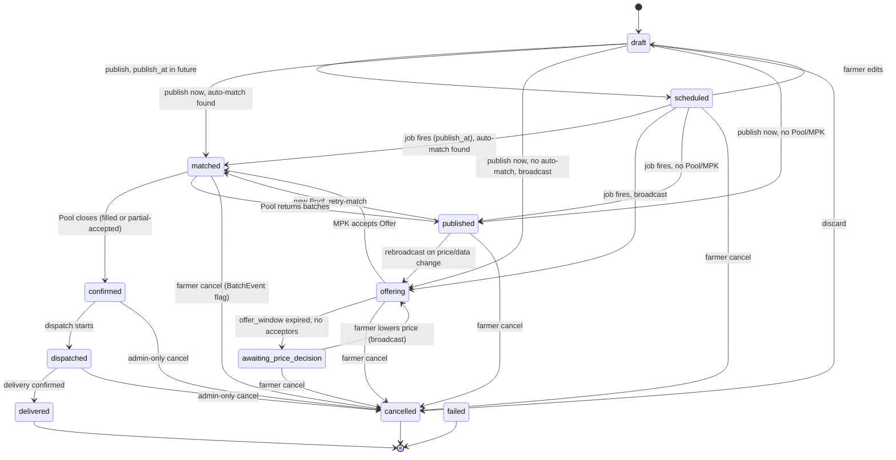

# Microstep 6 — TSP UX Flow v1.0 (WIP)
## AGOS Architecture Decision Record

| Field | Value |
|---|---|
| Date | 2026-06-03 |
| Status | 🟡 In progress. **Locked:** 5 гейтов + темпоральная модель + **полный M6-A** + review-слой + контейнерная модель заявки МПК + **полный M6-B** (D-M6-1…14). **Pending:** только M6-C (flow админа TURAN). |
| Builds on | M1 Identity v0.2, M2 AssociationMembership FSM v1.0, M3 Feature Governance v1.0, **M4 Batch/Pool/Offer v1.0** |
| Amends | M4 §2.2 (matching predicate); §2.6/D-TSP-8 (price step); §3 (FSM Batch +1); §3.3 BT-16 (dispatch authority); §6.4 (BatchEvent); §7.2 (MPK visibility); **D-TSP-1/D-TSP-2 (Pool → контейнер с категорийными строками; `Batch.pool_id` → `Batch.pool_line_id`)** |
| Adds | Review-слой (`ReviewDimension`, `DealReview`, `DealReviewDimensionScore`); **`PoolLine`** (категорийная строка заявки). |
| Scope | Параметры TSP, темпоральная модель, полный M6-A, отзывы, контейнерная модель заявки МПК, полный M6-B (flow МПК). |
| Out of scope (этой версии) | M6-C (flow админа); финальные UI-копи; SQL DDL; `FeatureLimit`. |
| Next | M6-C: flow админа TURAN. |

---

## 0. TL;DR (что утверждено в этой сессии)

- **5 параметров TSP закрыты.** offer_window=24ч, mpk_decision_window=24ч, price step = **фикс 100 ₸/кг** (не %), region matching = **район** (Pool задаёт набор районов), покупатель раскрывается фермеру **только при `confirmed`**.
- **Темпоральная модель Batch.** Каждый Batch несёт **окно готовности** `[ready_from, ready_to]`. Matching сводит окно готовности Batch с окном поставки Pool по **пересечению** (resolves `Q-TSP-DELIVERY-DATE`).
- **Спот и отложенная публикация — один механизм.** `scheduled_publish_at = ready_from − publish_lead`. Если `≤ now` → спот (matching сразу), иначе → новое состояние `scheduled` до даты. Для пилота — только это (Модель B). Форвардный контракт (Модель A) отложен в отдельный микрошаг.
- **Полный M6-A** (фермер): создание → категория → цена → публикация (3 исхода) → ожидание → подтверждение (раскрытие покупателя) → отгрузка/приёмка → unhappy paths.
- **Полный M6-B** (МПК): заявка-контейнер с категорийными строками (общий тотал + цена/категория, MAX опц., MIN нет) → мониторинг → обработка Offer (экран «выше плана») → набор/underfill → приёмка → unhappy → отзыв.
- **Двусторонние отзывы** (D-M6-11): overall + 1 ключевая role-specific размерность + текст, double-blind, per-batch.
- **Раскрытие личности** — симметрично, только при `confirmed` (D-M6-5/D-M6-12); репутация (★) — анонимно до сделки.
- Принято **D-M6-1…14**. Остаётся **M6-C** (flow админа TURAN).

---

## 1. Параметры TSP (5 гейтов) — LOCKED

| ID | Значение | Примечание |
|---|---|---|
| `offer_window` | **24 ч** | Окно ответа МПК на broadcast-Offer (FCFS). Конфиг ассоциации. |
| `mpk_decision_window` | **24 ч** | Окно решения МПК при underfilled Pool (вернуть/партиал). Дефолт при молчании — вернуть (farmer-friendly, D-TSP-10). |
| `price_step_down_amount` | **100 ₸/кг** (фикс) | Заменяет `price_step_down_pct`. См. D-M6-3. |
| region matching | **район (rayon)** | Pool задаёт набор районов. См. D-M6-4. |
| MPK visibility | **при `confirmed`** | Покупатель раскрывается фермеру только после закрытия Pool. Amends M4 §7.2. См. D-M6-5. |
| `publish_lead` | **7 дней** (дефолт) | Насколько раньше `ready_from` Batch выходит в matching. Конфиг ассоциации. См. D-M6-9. |

Все значения — standards-as-data (P8): меняются записью в конфиг, не деплоем.

---

## 2. Темпоральная модель Batch — LOCKED

### 2.1. Окно готовности

- `Batch.ready_from DATE`, `Batch.ready_to DATE`, инвариант `ready_to ≥ ready_from`.
- Смысл: «партия готова к отгрузке в любой момент этого окна». `ready_from` = раньше всего готова; `ready_to` = докуда фермер готов держать.
- **Storage = каноничный интервал; input = грубый.** UX (деталь M6) даёт пресеты («готова сейчас» / «в этом месяце» / «в следующем» / «через 2 месяца» / «указать даты»), каждый резолвится в `[ready_from, ready_to]`. Это исключает ложную точность и держит matching на единой логике overlap (P4, P6, P9).
- Спот-пресет «готова сейчас»: `ready_from = today`, `ready_to` — фермер подвинет (дефолт окна ~2 недели).
- Поля редактируемы в `draft` / `scheduled` / `published`; **лочатся при переходе в `matched`** (как `farmer_price`).
- P11: широкое окно сейчас, сужается позже по мере набора веса.

### 2.2. Унификация спота и расписания (Модель B)

```
scheduled_publish_at = ready_from − publish_lead
```

- `publish_at ≤ now` → matching запускается сразу = **спот**.
- `publish_at` в будущем → Batch ждёт в `scheduled`, scheduled-job запускает matching в `publish_at` = **отложенная публикация**.

Один путь кода, без спецкейса спот/форвард (P7).

### 2.3. Matching-предикат (amends M4 §2.2)

К условиям поиска Pool добавляется пересечение окон:

```
AND batch.ready_from <= pool.delivery_to
AND batch.ready_to   >= pool.delivery_from
```

Это разрешает `Q-TSP-DELIVERY-DATE` = **overlap окон** (не точное совпадение).

### 2.4. Модель A (форвардный контракт) — отложена

Лочить покупателя на месяц вперёд = отдельный продукт. Требует: ре-подтверждение у поставки, обработку отклонения веса от плана, политику форвардной цены, усиленный governance отмены при долгом `confirmed`. Вынесено в будущий микрошаг **M6-A-fwd**. В пилоте — только Модель B (§2.2).

---

## 3. FSM Batch — обновление (amends M4 §3)

Добавлено **одно** состояние: `scheduled`. Остальные 10 — без изменений (см. M4 §3.1).

| State | Значение | Capabilities |
|---|---|---|
| `scheduled` | Опубликован с будущей датой выхода; ждёт `publish_at` | Правка (→ `draft`-семантика полей), отмена |

### 3.1. Mermaid (с новым состоянием)



### 3.2. Новые переходы

| # | From | To | Trigger | Authority |
|---|---|---|---|---|
| BT-20 | draft | scheduled | publish, `publish_at > now` | Farmer owner |
| BT-21 | scheduled | matched / offering / published | scheduled-job в `publish_at` прогоняет matching | System (scheduled) |
| BT-22 | scheduled | draft | farmer edits | Farmer owner |
| BT-23 | scheduled | cancelled | farmer cancel | Farmer owner |

### 3.3. Новые BatchEvent (amends M4 §6.4)

`scheduled`, `auto_published`.

---

## 4. M6-A — Flow фермера, часть 1: создание и публикация (шаги 0–4) — CONFIRMED

Сквозной принцип: слова **Pool / Offer / match / target_volume / filled_volume** не появляются в фермерском UI (M4 §7, constraint §6).

### Шаг 0 — Гейт входа
- **Условие:** Organization имеет членство `active` или `grace_period` (M3 FeatureGate `tsp`).
- **Не член:** только TSP-teaser + CTA «Вступить в TURAN» (→ M5 / MembershipApplication). Кнопок создания Batch нет.
- **RPC:** `rpc_check_feature_access('tsp')` перед рендером раздела.

### Шаг 1 — Черновик партии
- **Фермер вводит:** порода, средний вес головы (кг), возраст (мес), упитанность/кондиция, число голов, район, **окно готовности** (грубый пресет → `[ready_from, ready_to]`, см. §2.1).
- **Сущности:** `Batch` → `draft`; `BatchEvent(created)`.
- **RPC:** `rpc_create_batch` → `batch_id`.
- **Capability:** membership-гейт + `FeatureLimit` на число активных Batch (значение TBD).
- **Проекция:** «Новая партия — опишите животных». Неполный черновик допустим (P11).

### Шаг 2 — Категория (выводится)
- **Система** выводит категорию из (порода + ср.вес + возраст + кондиция) по версионируемому классификатору (M4 §6.1). Фермер **не выбирает** (P9, constraint §6.6).
- **Сущности:** `Batch.category_id` (preview в draft) + `Batch.classifier_version` (фиксируется при публикации).
- **RPC:** `rpc_derive_category(breed, age, weight, condition)` — preview; та же логика внутри `rpc_publish_batch`.
- **Проекция (happy):** «Категория: <display_name>» read-only + микрокопи «определяется автоматически».
- **Unhappy (pre-publish):** `unknown_category` → публикация заблокирована. Копи: «Не смогли определить категорию — напишите в TURAN, добавим в справочник». Не экран ошибки.

### Шаг 3 — Reference price + своя цена
- **Система показывает** `reference_price` категории: «рекомендуемая цена — X ₸/кг» (D-TSP-2; ответ несёт `disclaimer_text`, ст.171 ПК РК).
- **Фермер ставит** `farmer_price` (₸/кг). Если `< minimum_price` → **soft warning** (D-TSP-4). Пройти можно с явным подтверждением.
- **Сущности:** `Batch.farmer_price`.
- **RPC:** read `rpc_get_reference_price(category_id)` + `rpc_get_minimum_price(category_id)` (новые под M4; реестр пока держит до-M4 `rpc_get_price_grid`). Жёсткий soft-warn чекпоинт — в `rpc_publish_batch`.
- **Проекция:** reference = «рекомендуемая/средняя», никогда «обязательная» (§8.2 M4). Цены других фермеров и МПК не видны (constraints §6.2–6.4).

### Шаг 4 — Публикация: расписание + три исхода
**RPC:** `rpc_publish_batch`. Порядок: soft-warn чекпоинт → фиксация `classifier_version` + категории → вычисление `publish_at` (§2.2).

- Если `publish_at > now` → Batch → `scheduled`. Проекция: **«Запланировано — выйдет в продажу <publish_at>»**. Matching сработает в дату.
- Если `publish_at ≤ now` → matching (M4 §2.2 + предикат overlap §2.3):

| Исход | Backend | Фермерская проекция | Видит / НЕ видит |
|---|---|---|---|
| **A. Auto-match** | `matched`, `pool_id` set, `deal_price = mpk_price` (≥ его цены), `filled_volume +=`, close_pool если добрал. `BatchEvent(matched_auto)` | «Нашёлся покупатель — ждём подбора партии» | Видит **цену сделки** (≥ запрошенной). **Не видит** покупателя (раскрытие при `confirmed`, D-M6-5), не видит Pool |
| **B. Broadcast** | N `Offer(pending)`, окно 24ч, → `offering`. `BatchEvent(offering_started)` | «Отправлено покупателям — ждём согласия» | Одну строку. Не видит число Offer, кому, по какой цене |
| **C. Нет Pool/МПК** | → `published`, ждёт retry-match. `BatchEvent(published)` | «Опубликовано — ждём покупателя» | — |

**Последствие выбора района (D-M6-4):** исход **C** срабатывает чаще, чем при области. Корректно (физика перевозки, P5), но повышает важность retry-match и копирайта `published` («это нормально, ждём»).

---

## 4b. M6-A — Flow фермера, часть 2: ожидание → подтверждение → доставка + unhappy

**Уведомления — channel-agnostic.** Каждый переход Batch → `BatchEvent` → событие Dok4 Event Bus → диспетчер уведомлений. Канал (push/SMS/WhatsApp) = `Q-TSP-FAILED-FARMER-NOTIF`, открыт, flow от него не зависит (P7).

### Шаг 5 — Уведомления по исходу публикации

| Событие | Уведомление фермеру | Салиентность |
|---|---|---|
| `matched_auto` / `matched_via_offer` | «Нашёлся покупатель на вашу партию» | Высокая |
| `offering_started` | — (статус в кабинете) | Низкая |
| `published` (исход C) | — (пассивно) | Низкая |
| `auto_published` (сработал `scheduled`) | «Ваша партия вышла в продажу» | Средняя |

### Шаг 6 — Ожидание `matched` → `confirmed`
- **Видит:** «Нашёлся покупатель — ждём подбора партии», **цену сделки** (≥ его цены), голов, окно готовности. **НЕ видит:** покупателя (D-M6-5), прогресс заполнения (никаких target/filled).
- **Может:** отмена с `cancelled_after_match` (BT-15) + предупреждение «покупатель найден, отмена будет отмечена» (D-TSP-14; пенальти нет в MVP). Цена/окно залочены.
- **Копи без ложной срочности:** длительность = остаток окна Pool + `mpk_decision_window`. Рамка: «покупатель собирает полный заказ».
- **Side effect отмены:** `pool.filled_volume −= head_count`, Pool остаётся `filling`.

### Шаг 7 — Pool закрылся → `confirmed` (покупатель раскрывается)
- **Триггер:** `close_pool` (M4 §2.4) — target/overshoot или партиал. Matched-батчи → `confirmed` (BT-13). `BatchEvent(confirmed)`.
- **Уведомление (высокая):** «Сделка подтверждена. Покупатель: **<МПК>**. Цена: **Z ₸/кг**. Готовим отгрузку.» — **здесь срабатывает D-M6-5**.
- **НЕ может** сам отменить (D-TSP-15). Вместо кнопки — «Нужно отменить? Свяжитесь с TURAN» → форма (constraint §6.7).

### Шаг 8 — Dispatch → Delivery (двусторонний handshake, D-M6-10)
- `confirmed → dispatched` (BT-16): **фермер** жмёт «Партия отгружена». `BatchEvent(dispatched)`. Проекция «В пути».
- `dispatched → delivered` (BT-18): **МПК** подтверждает приёмку **по каждому батчу** (delivery — на уровне Batch, не Pool). `BatchEvent(delivered)`. Проекция «Доставлено» (terminal +). Спор → админ.
- После `delivered` открывается окно отзыва (см. §4c).

### Шаг 9 — Unhappy paths

**9a. Offer-окно истекло, нет согласных** (`offering → awaiting_price_decision`, BT-09)
- Проекция «Покупатели не согласились — что делаем дальше?». Действия: понизить до `current − 100` / задать свою / отозвать. RPC `rpc_lower_batch_price` → ребродкаст (BT-11).
- **Стоп-правило (D-M6-3):** если `suggested ≤ minimum_price` — авто-предложение не даём. Остаётся: вручную ниже (soft warn) / **оставить и ждать** (→ `published`) / отозвать.

**9b. Underfilled Pool, МПК вернул батчи** (`matched → published`, BT-14)
- `pool_id=NULL`, `deal_price=NULL`, `BatchEvent(returned_to_published_after_pool_fail)`.
- Уведомление (высокая): «Покупатель не набрал нужный объём — ваша партия снова в продаже. Это не связано с вашей партией.»

**9c. МПК принял партиал** (`matched → confirmed`, BT-13 partial)
- Со стороны фермера идентично нормальному `confirmed`. Партиал — внутренняя забота МПК.

**9d. Отзыв фермером — три режима**

| Когда | Переход | Что |
|---|---|---|
| До match | → `cancelled` | Свободно. `cancelled_before_match`. `offering` → Offer `withdrawn` (BT-10) |
| После match (`matched`) | → `cancelled` (BT-15) | Разрешено + предупреждение. `cancelled_after_match`. `pool.filled_volume −=`. Без пенальти |
| После `confirmed` (`confirmed`/`dispatched`) | → `cancelled` (BT-17/19) | **Только админ** (D-TSP-15). Форма обращения. `cancelled_during_execution` |

**9e. `scheduled` до выхода в продажу:** `scheduled → draft` (BT-22) / `scheduled → cancelled` (BT-23). Свободно.

---

## 4c. Review-слой (взаимные отзывы) — D-M6-11

**Два разных сигнала, не путать:** поведенческий рейтинг = агрегация над `BatchEvent` (D-TSP-14, объективный, без новых таблиц). **Отзыв** = субъективное мнение контрагента — новые данные, новый additive слой. Репутация орга = композит обоих.

**Оценки асимметричны по роли (P5):**

| Фермер → МПК | МПК → Фермер |
|---|---|
| **Честность взвешивания** ⭐ (ключевая в пилоте) | **Соответствие скота заявленному** ⭐ (ключевая в пилоте) |
| Справедливость приёмки | Качество / здоровье скота |
| Соответствие расчёта | Надёжность отгрузки |
| Коммуникация | Коммуникация |

**Решение для пилота:** overall (1–5, обязательно) + **1 ключевая размерность на роль** + текст (опц.). Схема держит N размерностей (P3 — грань детальная, UI лёгкий), новые включаются без правки схемы (P8).

**Модель (additive, P7):**
```
ReviewDimension(id, code, label, applies_to ['farmer_rates_mpk'|'mpk_rates_farmer'], active, version)
DealReview(id, batch_id, reviewer_org_id, reviewee_org_id, direction, overall_score 1-5, comment, submitted_at, visible_at)
DealReviewDimensionScore(review_id, dimension_id, score 1-5)
```
- **Единица — Batch** (доставленная бинарная сделка). Один отзыв на направление на батч. Открывается после `delivered`. Иммутабелен после подачи (P12).
- **Агрегат репутации — производный view** (P4): отзыв = источник, средняя = derived.
- **Double-blind reveal:** отзыв контрагента скрыт до подачи обоих или истечения окна (напр. 7 дней после `delivered`) — поле `visible_at`. Лечит tit-for-tat.

---

## 4d. Контейнерная модель заявки МПК (D-M6-13)

Refine модели «один Pool = одна категория» (M4). Заявка МПК = **контейнер с общим тоталом + категорийные строки**. Это разная цена по категориям + гибкий микс под общий объём, **без MIN** (см. ниже почему).

```
Pool (заявка МПК):
    total_target_volume   ОБЯЗАТЕЛЬНО      -- напр. 1000 голов
    регион (набор районов, D-M6-4)
    окно поставки [delivery_from, delivery_to]

PoolLine (на категорию, 1..N):
    category_id           ОБЯЗАТЕЛЬНО
    mpk_price (₸/кг)      ОБЯЗАТЕЛЬНО, hard floor ≥ minimum_price (D-TSP-4)
    max_volume / max_pct  ОПЦИОНАЛЬНО       -- потолок
    min                   НЕ ДЕЛАЕМ

Batch.pool_line_id → строка (несёт категорию + цену). Заменяет Batch.pool_id (amends D-TSP-2).
```

**Принцип «MAX можно, MIN нельзя»:** MAX только запрещает матчи → не создаёт невыполнимых состояний. MIN резервирует общую ёмкость под категорию, которую рынок может не поставить → заявка застревает в underfill. Поэтому потолок — да, минимум — нет. Гарантированный минимум по категории = отдельная заявка.

**Дельты движка (контролируемая генерализация M4, per-batch FSM не меняется):**
- Matching-предикат: `+ заявка открыта (total_filled < total_target) AND line.price ≥ farmer_price AND line.filled + heads ≤ line.max (если задан)`.
- Close: при `total_filled ≥ total_target`. Overshoot **тотала** принимается на последнем батче (D-TSP-9); overshoot **категорийного max** — нет (max жёсткий фильтр до матча).
- Underfill: решение МПК (вернуть / партиал, M4 §2.5) на уровне **всей заявки**.

---

## 4e. M6-B — Flow МПК «Закупить партию», часть 1 (черновик)

МПК — бизнес, мыслит заявками/объёмами/предложениями → **farmer-projection (запрет Pool/Offer) НЕ действует**. Антитраст-ограничения остаются (не видит цены других МПК, §6.4/§8).

### Шаг 0 — Гейт входа
- Organization `active`/`grace_period` **И** тип `mpk` (OrganizationTypeAssignment). Антитраст-гейт §8.7 (не продавец+покупатель в одном Pool).
- **RPC:** `rpc_check_feature_access('tsp')` + проверка org-типа.

### Шаг 1 — Создание заявки (контейнер + строки)
- **МПК вводит:** `total_target_volume`; регион (набор районов, D-M6-4); окно поставки; и **строки-категории** — каждая: категория + `mpk_price` (hard floor) + `max` (опц.).
- **Hard floor (D-TSP-4):** на **каждой строке** `mpk_price < minimum_price` → **блок** (не warning).
- **Сущности:** `Pool` → `draft`; `PoolLine` ×N; `pool_region`; `PoolEvent(created)`.
- **RPC:** `rpc_create_pool` (с массивом строк; заменяет до-M4 `rpc_create_pool_request`).

### Шаг 2 — Публикация → `filling` + мониторинг
- **RPC:** `rpc_publish_pool` → `filling`. Запускается retry-match против висящих `published` Batch'ей (BT-05) — заявка может сразу втянуть подходящие партии.
- **Мониторинг (данные МПК):** заполнение **по каждой категории** + общий тотал; втянутые партии по характеристикам; per-batch и blended-стоимость (разные `deal_price` по строкам).
- **Проекция:** «Заявка на закупку», «заполнено X из Y», «предложения от поставщиков».

### Шаг 3 — Получение Offer (broadcast)
- Фермерский Batch без авто-матча, но заявка подходит (категория+регион+объём, **даже если `mpk_price < farmer_price`**) → система шлёт Offer. Уведомление «Новое предложение».
- Offer несёт характеристики батча + `offered_price` + анонимную репутацию (★). Личность фермера — раскрывается при `confirmed` (D-M6-12).

### Шаг 4 — Принятие / отклонение Offer ⭐ (экран «выше плана»)
`offered_price` может быть **выше** `mpk_price` строки — экран обязан показать сравнение честно:
```
Предложение: 40 гол · ср.вес 450кг · «Бычки откормочные» · готовы 10–20 июля
Репутация поставщика: ★ 4.3   (анонимно; личность — при confirmed, D-M6-12)
Цена предложения 1600 ₸/кг  |  ваша плановая 1500 ₸/кг  ▲ +100
Принять — закроет 40 из остатка заявки.   [Принять] [Отклонить]
```
- **Принять (`rpc_accept_offer`, M4 §2.3):** offer→`accepted`, прочие Offer батча→`withdrawn`, batch→`matched` в строке, `deal_price = offered_price` (выше плана, осознанно), `filled_volume +=`, close если добрал тотал.
- **Отклонить (`rpc_reject_offer`):** →`rejected`. Молчание → `expired` (24ч).
- **Антитраст:** решение в своём UI без знания о других МПК (§8.6). Экран не подталкивает.

> **D-M6-12 (подтверждён):** личность контрагента раскрывается обеим сторонам только при `confirmed` (симметрично D-M6-5); до этого МПК видит характеристики + агрегатную репутацию (★) **анонимно**. Анонимная репутация до сделки — да (ценность review-системы без дискриминации по имени).

---

## 4f. M6-B — Flow МПК, часть 2: набор → приёмка + unhappy + отзыв

Pool FSM (M4 §4) работает на уровне **контейнера** над общим тоталом — состояния не меняются.

### Шаг 5 — Тотал набран → закрытие → `confirmed`
- **Триггер:** `total_filled ≥ total_target` (overshoot тотала принят, D-TSP-9). `close_pool` (M4 §2.4, обобщён): Pool → `closed_filled`; matched-батчи всех строк → `confirmed`; **все pending Offer заявки → `withdrawn`**.
- **Раскрытие (D-M6-12):** при `confirmed` МПК видит личности фермеров, фермеры — МПК.
- **Уведомление (высокая):** «Заявка набрана: X голов (по категориям…). Готовим приёмку.»
- **По строкам:** строка достигла `max` (тотал ещё нет) → pending Offer этой категории → `withdrawn`, новые не матчатся; заявка добирает другими категориями.

### Шаг 6 — Underfill (окно истекло, тотал не набран)
- `total_filled == 0` → `expired_empty`. `0 < filled < target` → `awaiting_mpk_decision`. Уведомление (высокая, time-sensitive). Окно = `mpk_decision_window` (24ч).

| Решение | Переход | Эффект |
|---|---|---|
| **A. Вернуть** (`rpc_pool_return_batches`) | `closed_unfilled` | Matched → `published` (`pool_line_id`=NULL, `deal_price`=NULL). Фермеры уведомлены (M6-A 9b). **Дефолт при молчании** (D-TSP-10) |
| **B. Принять частично** (`rpc_pool_accept_partial`) | `closed_partial` | Собранный микс → `confirmed`. target = filled |

- **Гранулярность — order-level (D-M6-14):** решение на всю заявку. Селективный возврат по строкам отложен.

### Шаг 7 — Приёмка (`executing → completed`)
- `closed_filled`/`closed_partial` → `executing`. Фермер пометил «отгружено» (D-M6-10) → МПК видит «в пути» (с именем). **МПК подтверждает приёмку по каждому батчу** (`rpc_confirm_delivery`): `dispatched → delivered` (BT-18).
- Все батчи `delivered` → Pool → `completed`. Спор о приёмке/весе → админ.

### Шаг 8 — Unhappy paths

| Сценарий | Переход | Эффект |
|---|---|---|
| **8a. Отмена заявки до набора** (`rpc_cancel_pool`) | `filling → cancelled` | Matched всех строк → `published`; pending Offer → `withdrawn`; фермеры уведомлены. Authority — МПК. После `confirmed`+ — **только админ** (симметрично D-TSP-15) |
| **8b. Частичное исполнение** | — | = шаг 6 вариант B |
| **8c. Фермер отозвал после match** | у МПК `filled −=` | Уведомление «Поставщик отозвал партию», заявка добирает. Авто-пишется в `cancelled_after_match` → рейтинг фермера (D-TSP-14). Ручных действий не требует |

### Шаг 9 — Отзыв МПК (вторая сторона D-M6-11)
- После `delivered`: МПК оценивает фермера — overall 1–5 + ключевая размерность **«соответствие скота заявленному»** + текст. По каждому батчу. Double-blind.
- **RPC:** `rpc_submit_deal_review(batch_id, direction='mpk_rates_farmer', …)`.

### Уведомления МПК (матрица)

| Событие | Уведомление | Салиентность |
|---|---|---|
| `offer.created` | «Новое предложение от поставщика» | Средняя |
| `pool.closed_filled` | «Заявка набрана» | Высокая |
| `pool.awaiting_mpk_decision` | «Окно истекло — решите: вернуть/частично» | Высокая |
| `batch.cancelled_after_match` | «Поставщик отозвал партию» | Средняя |
| `batch.dispatched` | «Партия в пути — подготовьте приёмку» | Средняя |
| `pool.completed` | «Закупка завершена» | Низкая |

---

## 5. Key Decisions (этой сессии)

### D-M6-1 — offer_window = 24ч; mpk_decision_window = 24ч
Отправные значения для пилота. Конфиг ассоциации. Калибруются на пилотных МПК.

### D-M6-2 — *(объединён в D-M6-1)*

### D-M6-3 — Шаг понижения цены = фикс 100 ₸/кг
Заменяет процент (amends D-TSP-8). Поле `price_step_down_pct` → `price_step_down_amount`. Формула `suggested = current_price − 100`. **Стоп-правило:** авто-suggested клампится на `minimum_price` — ниже система не предлагает понижать; фермеру остаётся «задать вручную» (с soft warning) или «отозвать». Держит floor как защиту, не координацию (D-TSP-4).
**Последствие:** в отличие от %, фикс-шаг линейно идёт к нулю — стоп-правило обязательно.

### D-M6-4 — Region matching на уровне района
Pool задаёт **набор районов**: «вся область» (= все районы области) или конкретные районы. Batch несёт один район. Match при `batch.rayon ∈ pool.rayons`. Рекомендуемое представление — дочерняя `pool_region(pool_id, region_type ['oblast'|'rayon'], region_id)`: сохраняет намерение, переживает добавление районов, additive (P6, P7). Финализация — backend imp.
**Последствие:** рынок строже → чаще исход C (`published`).

### D-M6-5 — Покупатель раскрывается при `confirmed`
Amends M4 §7.2 (там было «при `matched`»). До закрытия Pool фермер знает «покупатель есть» + цену сделки, но не личность. Чище для антитраста. Маппинг лейблов §7.1 M4 не ломается.

### D-M6-6 — Окно готовности на Batch
`[ready_from, ready_to]`, каноничный интервал + грубый ввод (§2.1). Лочится при `matched`.

### D-M6-7 — Спот и расписание унифицированы; Модель B для пилота
`scheduled_publish_at = ready_from − publish_lead`; новое состояние `scheduled` (§3). Форвардный контракт (Модель A) отложен в M6-A-fwd (§2.4).

### D-M6-8 — Matching: overlap окон
Предикат пересечения окон (§2.3). Закрывает `Q-TSP-DELIVERY-DATE` = overlap.

### D-M6-9 — publish_lead = 7 дней (дефолт)
Конфиг ассоциации, standards-as-data.

### D-M6-10 — Dispatch/Delivery = двусторонний handshake
Amends M4 §3.3 BT-16 (authority → Farmer). Фермер подтверждает отгрузку (`confirmed → dispatched`), МПК подтверждает приёмку **по каждому батчу** (`dispatched → delivered`). Delivery — на уровне Batch, не Pool. Спор о приёмке → админ.

### D-M6-11 — Review-слой (взаимные отзывы)
Новый additive слой поверх поведенческого рейтинга D-TSP-14 (события остаются). Единица — Batch. Пилот: overall 1–5 + 1 ключевая role-specific размерность (взвешивание / соответствие заявленному) + текст; размерности — lookup `ReviewDimension` (P8), схема держит N. **Double-blind reveal** (`visible_at`) против tit-for-tat. Репутация орга — производный view (P4). Детали — §4c.

### D-M6-13 — Контейнерная модель заявки МПК (multi-category)
Заявка МПК = контейнер `Pool` (`total_target_volume` обяз.) + строки `PoolLine` на категорию (категория + `mpk_price`≥floor обяз.; `max` опц.; **MIN не делаем**). `Batch.pool_line_id` заменяет `Batch.pool_id` (amends D-TSP-1/D-TSP-2). Правило **«MAX можно, MIN нельзя»** (MAX фильтрует, MIN создаёт невыполнимые состояния). Движок M4 генерализуется на строки+тотал, per-batch FSM без изменений. Детали — §4d.

### D-M6-12 — Симметрия раскрытия личности
Личность контрагента раскрывается обеим сторонам только при `confirmed` (симметрично D-M6-5). До этого МПК видит характеристики партии + **анонимную репутацию (★)**. Анонимная репутация до сделки — да. Лечит дискриминацию/координацию по имени. Детали — §4e/§4f.

### D-M6-14 — Underfill-решение order-level (MVP)
При недоборе тотала МПК решает на уровне **всей заявки**: вернуть всё (`closed_unfilled`, дефолт при молчании) или принять собранный микс (`closed_partial`). Селективный возврат по строкам — отложен. Детали — §4f шаг 6.

---

## 6. Impact на документы

| Документ | Изменение |
|---|---|
| **M4 v1.0** | §2.2 +overlap +line/total/max-предикат (D-M6-13); §2.6/D-TSP-8 price step %→фикс+стоп; §3 +`scheduled` (+BT-20..23); §3.3 BT-16 authority → Farmer (D-M6-10); §6.4 +события; §7.2 visibility → `confirmed`; **D-TSP-1/2: Pool → контейнер, `Batch.pool_id` → `Batch.pool_line_id`**. |
| **Dok 3 (RPC catalog)** | Под M4+M6: read `rpc_get_reference_price`, `rpc_get_minimum_price`, `rpc_derive_category`; write `rpc_lower_batch_price`, `rpc_confirm_dispatch`, `rpc_confirm_delivery`, `rpc_submit_deal_review`, `rpc_create_pool` (массив строк), `rpc_publish_pool`, `rpc_accept_offer`, `rpc_reject_offer`, `rpc_pool_return_batches`, `rpc_pool_accept_partial`, `rpc_cancel_pool`; удалить `rpc_*_pool_request*`. Backend-проход. |
| **Dok 4 (Event Bus)** | +`batch.scheduled/auto_published/dispatched/delivered`, `review.submitted`, `pool.published/closed_filled/awaiting_mpk_decision/closed_partial/closed_unfilled/completed/cancelled`, `offer.created/accepted/rejected/expired/withdrawn`. |
| **d02_tsp.sql** | +`batch.ready_from/ready_to`, состояние `scheduled`, `pool_region`, конфиг TSP (`publish_lead`/`price_step_down_amount`/`mpk_decision_window`/`offer_window`); **Pool: `total_target_volume`, окно поставки; +`pool_line(category, mpk_price, max_volume)`; `batch.pool_line_id`**; +`review_dimension`, `deal_review`, `deal_review_dimension_score`. |

---

## 7. Open / Pending

| ID | Вопрос | Когда |
|---|---|---|
| M6-C | Flow админа TURAN (справочники, цены, классификатор, разбор споров/отмен) | Следующий блок |
| `FeatureLimit` Batch | Значение лимита активных Batch | До пилота |
| Q-TSP-RETRY-MATCH | Триггер/частота retry-match (важнее из-за D-M6-4) | Backend imp |
| Спот-горизонт `ready_to` | Дефолт ширины окна для «готова сейчас» | UX-валидация |
| Review-окно | Срок double-blind reveal (7 дней — отправная точка) | UX-валидация |
| Финализация `ReviewDimension` | Полный список размерностей сверх пилотной | После пилота |
| Селективный возврат по строкам | Per-line underfill-решение (отложено D-M6-14) | После пилота |
| Q-TSP-CATEGORY-CLASSIFIER | Финализация классификатора с зоотехником | До пилота |
| Q-TSP-FAILED-FARMER-NOTIF | Канал уведомления (push/SMS/WhatsApp) | Перед пилотом |

---

*v1.0 (WIP) — 2026-06-03. Locked: §1–§4f (полный M6-A + M6-B, D-M6-1…14). Pending: только M6-C (flow админа).*
